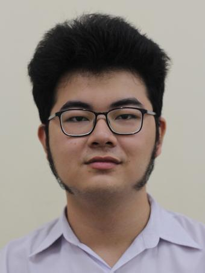

We are a team based in the [School of Computing, National University of Singapore](http://www.comp.nus.edu.sg). This project is  our module project for CS2103T, Software Engineering.

You can reach us at the state `seer[at]comp.nus.edu.sg`

## Project team

### Kishen Ashok Kumar

[[github](https://github.com/KishenKumarrrrr)] [[portfolio](team/kishenkumarrrrr.md)] [[Linkedin](https://www.linkedin.com/in/kishen-ashok-kumar-75b0a1190/)]

* Roles: Team Lead
* Responsibilities: Deliverables and Deadlines

### Rishabh Paliwal

[[github](https://github.com/the-reefshark)] [[portfolio](team/the-reefshark.md)] [[Linkedin](https://www.linkedin.com/in/rishabh-paliwal-44b865190/)]

* Role: Developer
* Responsibilities: Documentation

### Tran Gia Phong

[[github](https://github.com/PhongTran98)] [[portfolio](team/phongtran98.md)] [[Linkedin](https://www.linkedin.com/in/gia-phong-tran-1b30b519b/)]

* Role: Developer
* Responsibilities: Testing + Integration

### Nguyen Khanh Duy

[[github](http://github.com/duynguyen24501)] [[portfolio](team/duynguyen24501.md)] [[Linkedin](https://www.linkedin.com/in/nguyen-khanh-duy-25a595121/)]

* Role: Developer
* Responsibilities: Scheduling and Tracking

### Roger Lim

[[github](https://github.com/rogerlys)] [[portfolio](team/rogerlys.md)]

* Role: Code Quality
