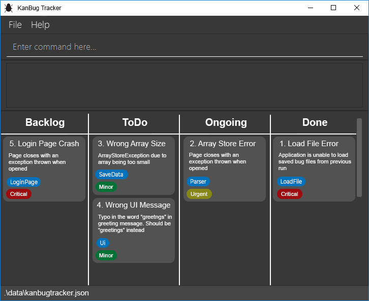

* Table of Contents
{:toc}
--------------------------------------------------------------------------------------------------------------------

## **Setting up, getting started**

Refer to the guide [_Setting up and getting started_](SettingUp.md).

--------------------------------------------------------------------------------------------------------------------

## **Design**

### Architecture

The ***Architecture Diagram*** given above explains the high-level design of the App. Given below is a quick overview of each component.

**`Main`** has two classes called [`Main`](https://github.com/AY2021S1-CS2103T-W17-1/tp/blob/master/src/main/java/seedu/address/Main.java) and [`MainApp`](https://github.com/AY2021S1-CS2103T-W17-1/tp/blob/master/src/main/java/seedu/address/MainApp.java). It is responsible for,
* At app launch: Initializes the components in the correct sequence, and connects them up with each other.
* At shut down: Shuts down the components and invokes clean-up methods where necessary.

[**`Commons`**](#common-classes) represents a collection of classes used by multiple other components.

The rest of the App consists of four components.

* [**`UI`**](#ui-component): The UI of the App.
* [**`Logic`**](#logic-component): The command executor.
* [**`Model`**](#model-component): Holds the data of the App in memory.
* [**`Storage`**](#storage-component): Reads data from, and writes data to, the hard disk.

Each of the four components,

* defines its *API* in an `interface` with the same name as the Component.
* exposes its functionality using a concrete `{Component Name}Manager` class (which implements the corresponding API `interface` mentioned in the previous point.

For example, the `Logic` component (see the class diagram given below) defines its API in the `Logic.java` interface and exposes its functionality using the `LogicManager.java` class which implements the `Logic` interface.

**How the architecture components interact with each other**

The *Sequence Diagram* below shows how the components interact with each other for the scenario where the user issues the command `delete 1`.

The sections below give more details of each component.

### UI component

**API** :
[`Ui.java`](https://github.com/AY2021S1-CS2103T-W17-1/tp/blob/master/src/main/java/seedu/address/ui/Ui.java)

The UI consists of a `MainWindow` that is made up of parts e.g.`CommandBox`, `ResultDisplay`, `PersonListPanel`, `StatusBarFooter` etc. All these, including the `MainWindow`, inherit from the abstract `UiPart` class.

The `UI` component uses JavaFx UI framework. The layout of these UI parts are defined in matching `.fxml` files that are in the `src/main/resources/view` folder. For example, the layout of the [`MainWindow`](https://github.com/AY2021S1-CS2103T-W17-1/tp/blob/master/src/main/java/seedu/address/ui/MainWindow.java) is specified in [`MainWindow.fxml`](https://github.com/AY2021S1-CS2103T-W17-1/tp/blob/master/src/main/resources/view/MainWindow.fxml)

The `UI` component,

* Executes user commands using the `Logic` component.
* Listens for changes to `Model` data so that the UI can be updated with the modified data.

### Logic component

**API** :
[`Logic.java`](https://github.com/AY2021S1-CS2103T-W17-1/tp/blob/master/src/main/java/seedu/address/logic/Logic.java)

1. `Logic` uses the `KanBugTrackerParser` class to parse the user command.
1. This results in a `Command` object which is executed by the `LogicManager`.
1. The command execution can affect the `Model` (e.g. adding a bug).
1. The result of the command execution is encapsulated as a `CommandResult` object which is passed back to the `Ui`.
1. In addition, the `CommandResult` object can also instruct the `Ui` to perform certain actions, such as displaying help to the user.

Given below is the Sequence Diagram for interactions within the `Logic` component for the `execute("delete 1")` API call.

:information_source: Note: The lifeline for `DeleteCommandParser` should end at the destroy marker (X) but due to a limitation of PlantUML, the lifeline reaches the end of diagram.

### Model component

**API** : [`Model.java`](https://github.com/AY2021S1-CS2103T-W17-1/tp/blob/master/src/main/java/seedu/address/model/Model.java)

The `Model`,

* stores a `UserPref` object that represents the user’s preferences.
* stores the KanBug Tracker data.
* exposes an unmodifiable `ObservableList<Bug>` that can be 'observed' e.g. the UI can be bound to this list so that the UI automatically updates when the data in the list change.
* does not depend on any of the other three components.

:information_source: Note: An alternative (arguably, a more OOP) model is given below. It has a `Tag` list in the `KanBugTracker`, which `Bug` references. This allows `KanBugTracker` to only require one `Tag` object per unique `Tag`, instead of each `Bug` needing their own `Tag` object. 

### Storage component

**API** : [`Storage.java`](https://github.com/AY2021S1-CS2103T-W17-1/tp/blob/master/src/main/java/seedu/address/storage/Storage.java)

The `Storage` component,
* can save `UserPref` objects in json format and read it back.
* can save the KanBug Tracker data in json format and read it back.

### Common classes

Classes used by multiple components are in the `seedu.address.commons` package.

### Proposed implementation

=======
## **Implementation**

This section describes some noteworthy details on how certain features are implemented.

### \[Proposed\] Edit Tag feature

#### Proposed Implementation
#### Proposed Implementation

The proposed edit tag feature is facilitated by `EditTagCommand`. It extends `Command` and uses **editTag** as its `COMMAND_WORD`  and makes use of the **ot/** and **nt/** prefixes.

Additionally, it implements the following operations:

- `EditTagCommand#execute()`  —  Executes the command. 

Given below is an example usage scenario and how the edit tag feature behaves at each step.

Step 1. The user launches the application for the first time. The `KanBugTracker` will be initialized with the initial kanbug tracker state.

Step 2. The user executes `add n/Print bug d/prints the wrong message s/todo t/Ui.java` command to add a new bug to the kanbug tracker. A new bug with the following information is added:

- name: **Print bug**
- description: **prints the wrong message**
- state: **todo**
- tag: **Ui.java**

This bug is added as the 6th bug in the kanbug tracker.

**Note that the index 6 is for illustration purposes only**

Step 3. The user decides that the tag they added is incorrect and would like to modify it. The user executes `editTag 6 ot/Ui.java nt/display`. This will result in the tag of the bug at index 6 being modified such that the new tag is **display** instead of **Ui.java**.

The updated bug is as follows:

- name: **Print bug**
- description: **prints the wrong message**
- state: **todo**
- tag: **display**

### [Proposed] Add tag feature

#### Proposed Implementation

The proposed edit tag feature is facilitated by `AddTagCommand`. It extends `Command` and uses **addTag** as its `COMMAND_WORD`  and makes use of the **nt/** prefix.

Additionally, it implements the following operations:

- `AddTagCommand#execute()`  —  Executes the command. 

Given below is an example usage scenario and how the edit tag feature behaves at each step.

Step 1. The user launches the application for the first time. The `KanBugTracker` will be initialized with the initial kanbug tracker state.

Step 2. The user executes `add n/Print bug d/prints the wrong message s/todo t/Ui.java` command to add a new bug to the kanbug tracker. A new bug with the following information is added:

- name: **Print bug**
- description: **prints the wrong message**
- state: **todo**
- tag: **Ui.java**

This bug is added as the 6th bug in the kanbug tracker.

**Note that the index 6 is for illustration purposes only**

Step 3. The user decides that the tag they would like to add an additional tag to the bug. The user executes `addTag nt/wrongPrinting`. This will result in the tag of the bug at index 6 being modified such that an additional tag **wrongPrinting** is added to the bug.

The updated bug is as follows:

- name: **Print bug**
- description: **prints the wrong message**
- state: **todo**
- tag: **Ui.java**, **wrongPrinting**

### \[Proposed\] Bug priority

Feature description: Each bug will now have a priority level (low, medium, high) that will be shown on the GUI. Users
can add or edit a bug with the priority using the `pr/` tag. The priority is optional, but each bug must have at most
one priority only.

#### Proposed Implementation

The priority of a bug will be represented by `Priority` in the `seedu.address.model.bug` package. The `Priority` would
be quite similar to other classes in the same package such as `Description`, `Name`, that is:
- `Priority` will also have its own `MESSAGE_CONSTRAINTS` and `VALIDATION_REGEX`.
- We will need to update the `Bug` to include an instance of `Priority`, and also update its constructor.
- We will need to update `MESSAGE_USAGE` of `AddCommand` and `EditCommand`.
- We will also need to update `EditCommand.BugDescriptor`.
- We will add one more prefix constant called `PREFIX_PRIORITY` into `CliSyntax`.
- We will update the `AddCommandParser#parse` and `EditCommandParser#parse` accordingly to read the `pr/` argument.
- We will have to create `ParserUtil#parsePriority`.
- We will need to include an instance of `Priority` into `seedu.address.storage.JsonAdaptedBug`, and update all
of its methods to deal with priority.
- We will need to update `seedu.address.ui.BugCard` and `BugListCard.fxml` to include priority.

The followings are notable differences between `Priority` and other fields of `Bug`:
- The `VALIDATION_REGEX` of `PRIORITY` will be set such that its constructor can only accept the `String` `"low"`, 
`"medium"`, `"higher"` (either uppercase or lowercase)
- Aside from the 3 possible states of `Priority` (`"low"`, `"medium"` or `"high"`), it will also have the state `"null"` 
that represent when the bug have no priority indicated. This type of `Priority` will be create using an overload 
version of the constructor that accept no argument (`new Priority("low")` will create a low priority, but 
`new Priority()` will create a "null" priority. We will check if the `Priority` is "null" before showing it on the UI.

**Note**: This is to simplified the code so that every instance of `Bug` is mandatory and also avoid using `null` (which
could cause `NullPointerException` and break the app) at the same time. This approach is inspired by the Null Object 
Design Pattern.

#### Design consideration:

- **Alternative 1**: Create `Priority` as a separate class
    - Pros: Adhere OOP principles
    - Cons: Need to refactor quite a lot in many different places.
- **Alternative 2**: Create `Priority` as a subclass of `Tag` [rejected]
    - Cons: Break the Liskov Substitution Principle.
 
### \[Proposed\] Duy feature

#### Proposed Implementation

### \[Proposed\] FeatureUI kanban board window

#### Proposed Implementation
The kanban board window would comprise of 4 columns that would divide the list of bug by their states. This would be implemented by putting 4 BugListPane in a horizontal box. The 4 BugListPanes would be constructed using a Observerable list that contains only the bugs that belong to their respective state. This observerable list would be provided by the logic manager. These 4 BugListPanes would be filled when the method fillInnerParts() is called by MainWindow.

Given below is how the KanbanBoard window will create the 4 BugListpanes

Step 1:
The user lanches the app and the system initalises the UI.

Step 2:
MainWindow calls fillInnerParts() on KanbanBoard.

Step 3:
For each of the 4 states, KanbanBoard would call getFilteredBugListByState on logic manager to get the appropriate lists and create the BugListPane

Given below is sequence diagram for the creation of the BugListPanes:

### \[Proposed\] Rishabh feature

#### Proposed Implementation
_{Explain here how your feature will be implemented}_

## **Documentation, logging, testing, configuration, dev-ops**

* [Documentation guide](Documentation.md)
* [Testing guide](Testing.md)
* [Logging guide](Logging.md)
* [Configuration guide](Configuration.md)
* [DevOps guide](DevOps.md)

--------------------------------------------------------------------------------------------------------------------

## **Appendix: Requirements**

### Product scope

**Target user profile**:

* Has a need to manage a significant number of bugs
* Prefers desktop apps over other types
* Can type fast
* Prefers typing to mouse interactions
* Is reasonably comfortable using CLI apps

**Value proposition**: Providing a command line interface for software engineering students to manage and track the bug fixing process faster than a typical mouse/GUI driven app

### User stories

Priorities: High (must have) - `* * *`, Medium (nice to have) - `* *`, Low (unlikely to have) - `*`

| Priority | As a …​                                    | I want to …​                     | So that I can…​                                                        |
| -------- | ------------------------------------------ | ------------------------------ | ---------------------------------------------------------------------- |
| `* * *`  | new user                                   | see usage instructions         | refer to instructions when I forget how to use the App                 |
| `* * *`  | user                                       | add a new bug              |                                                                        |
| `* * *`  | user                                       | delete a bug                | remove entries that I no longer need                                   |
| `* * *`  | user                                       | add notes to specific bugs   | quickly remeber details about the bug|
| `* * *`  | user                                       | keep track of the number of issues | keep track of the number of issues in my code|
| `* * *`  | user                                       | see all the bugs             | Know what are the bugs in my program|

### Use cases

(For all use cases below, the **System** is the `Kanbug Tracker` and the **Actor** is the `user`, unless specified otherwise)

**Use case: Delete a bug**

**MSS**

1.  User requests to list bugs
2.  Kanbug Tracker shows the list of bug
3.  User requests to delete a specific bug in the list
4.  Kanbug Tracker deletes the bug

    Use case ends.

**Extensions**

* 2a. The list is empty.

  Use case ends.

* 3a. The given index is invalid.

    * 3a1. Kanbug Tracker shows an error message.

      Use case resumes at step 2.

**Use case: Add a bug**

**MSS**

1. User requests to add bug

2. KanBug Tracker adds the new bug and displays the updated list of bugs

   to the user

   Use case ends.

**Extensions**

- 1a. The bug format is invalid

  - 1a1. Kanbug Tracker shows an error message.

    Use case resumes at step 1.

**Use case: Edit a bug**

**MSS**

1. User requests to list bugs

2. KanBug Tracker shows the list of bugs

3. User requests to edit a specific bug in the list

4. KanBug Tracker edits the bug

   Use case ends.

**Extensions**

- 2a. The list is empty.

  Use case ends.

- 3a. The given index is invalid.

  - 3a1. KanBug Tracker shows an error message.

    Use case resumes at 2.

- 3b. The user enters an invalid edit format

  - 3b1. KanBug Tracker shows an error message.

    Use case resumes at 2.

**Use case: Move a bug**

**MSS**

1. User requests to list bugs
2. KanBug Tracker shows the list of bugs
3. User requests to move a specific bug to another state
4. KanBug Tracker moves the bug

**Extensions**

- 2a. The list is empty.

  Use case ends.

- 3a. The given index is invalid.

  - 3a1. KanBug Tracker shows an error message.

    Use case resumes at 2.

- 3b. The user enters an invalid edit format.

  - 3b1. KanBug Tracker shows an error message.

    Use case resumes at 2.

### Non-Functional Requirements

1.  Should work on any _mainstream OS_ as long as it has Java `11` or above installed.
2.  A user with above average typing speed for regular English text (i.e. not code, not system admin commands) should be able to accomplish most of the tasks faster using commands than using the mouse.

### Glossary

* **Mainstream OS**: Windows, Linux, Unix, OS-X
* **Private bug fixing progress detail**: A bug fixing progress detail that is not meant to be shared with others

--------------------------------------------------------------------------------------------------------------------

## **Appendix: Instructions for manual testing**

Given below are instructions to test the app manually.

:information_source: Note: These instructions only provide a starting point for testers to work on;
testers are expected to do more *exploratory* testing.

### Launch and shutdown

1. Initial launch

   1. Download the jar file and copy into an empty folder

   1. Double-click the jar file Expected: Shows the GUI with a set of sample contacts. The window size may not be optimum.

1. Saving window preferences

   1. Resize the window to an optimum size. Move the window to a different location. Close the window.

   1. Re-launch the app by double-clicking the jar file. 
       Expected: The most recent window size and location is retained.

### Deleting a bug

1. Deleting a bug while all bugs are being shown

   1. Prerequisites: List all bugs using the `list` command. Multiple bugs in the list.

   1. Test case: `delete 1` 
      Expected: First bug is deleted from the list. Details of the deleted bug shown in the status message. Timestamp in the status bar is updated.

   1. Test case: `delete 0` 
      Expected: No bug is deleted. Error details shown in the status message. Status bar remains the same.

   1. Other incorrect delete commands to try: `delete`, `delete x`, `...` (where x is larger than the list size) 
      Expected: Similar to previous.

### Saving data

1. Dealing with missing/corrupted data files

   1. _{explain how to simulate a missing/corrupted file, and the expected behavior}_
