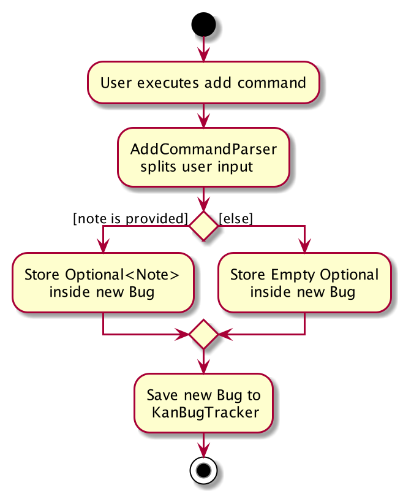
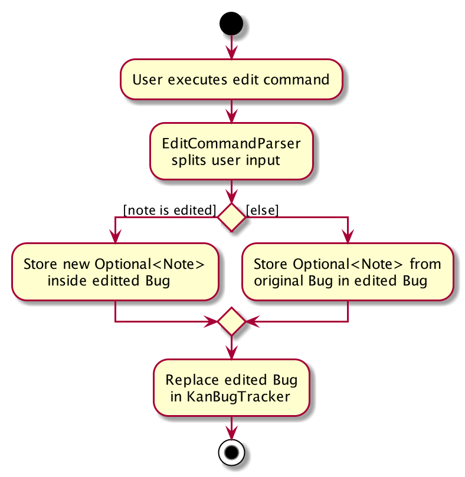

* Table of Contents
{:toc}
--------------------------------------------------------------------------------------------------------------------

## **Setting up, getting started**

Refer to the guide [_Setting up and getting started_](SettingUp.md).

--------------------------------------------------------------------------------------------------------------------

## **Design**

### Architecture

The ***Architecture Diagram*** given above explains the high-level design of the App. Given below is a quick overview of each component.

**`Main`** has two classes called [`Main`](https://github.com/AY2021S1-CS2103T-W17-1/tp/blob/master/src/main/java/seedu/address/Main.java) and [`MainApp`](https://github.com/AY2021S1-CS2103T-W17-1/tp/blob/master/src/main/java/seedu/address/MainApp.java). It is responsible for,
* At app launch: Initializes the components in the correct sequence, and connects them up with each other.
* At shut down: Shuts down the components and invokes clean-up methods where necessary.

[**`Commons`**](#common-classes) represents a collection of classes used by multiple other components.

The rest of the App consists of four components.

* [**`UI`**](#ui-component): The UI of the App.
* [**`Logic`**](#logic-component): The command executor.
* [**`Model`**](#model-component): Holds the data of the App in memory.
* [**`Storage`**](#storage-component): Reads data from, and writes data to, the hard disk.

Each of the four components,

* defines its *API* in an `interface` with the same name as the Component.
* exposes its functionality using a concrete `{Component Name}Manager` class (which implements the corresponding API `interface` mentioned in the previous point.

For example, the `Logic` component (see the class diagram given below) defines its API in the `Logic.java` interface and exposes its functionality using the `LogicManager.java` class which implements the `Logic` interface.

**How the architecture components interact with each other**

The *Sequence Diagram* below shows how the components interact with each other for the scenario where the user issues the command `delete 1`.

The sections below give more details of each component.

### UI component

**API** :
[`Ui.java`](https://github.com/AY2021S1-CS2103T-W17-1/tp/blob/master/src/main/java/seedu/address/ui/Ui.java)

The UI consists of a `MainWindow` that is made up of parts e.g.`CommandBox`, `ResultDisplay`, `BugListPanel`, `StatusBarFooter` etc. All these, including the `MainWindow`, inherit from the abstract `UiPart` class.

The `UI` component uses JavaFx UI framework. The layout of these UI parts are defined in matching `.fxml` files that are in the `src/main/resources/view` folder. For example, the layout of the [`MainWindow`](https://github.com/AY2021S1-CS2103T-W17-1/tp/blob/master/src/main/java/seedu/address/ui/MainWindow.java) is specified in [`MainWindow.fxml`](https://github.com/AY2021S1-CS2103T-W17-1/tp/blob/master/src/main/resources/view/MainWindow.fxml)

The `UI` component,

* Executes user commands using the `Logic` component.
* Listens for changes to `Model` data so that the UI can be updated with the modified data.

### Logic component

**API** :
[`Logic.java`](https://github.com/AY2021S1-CS2103T-W17-1/tp/blob/master/src/main/java/seedu/address/logic/Logic.java)

1. `Logic` uses the `KanBugTrackerParser` class to parse the user command.
1. This results in a `Command` object which is executed by the `LogicManager`.
1. The command execution can affect the `Model` (e.g. adding a bug).
1. The result of the command execution is encapsulated as a `CommandResult` object which is passed back to the `Ui`.
1. In addition, the `CommandResult` object can also instruct the `Ui` to perform certain actions, such as displaying help to the user.

Given below is the Sequence Diagram for interactions within the `Logic` component for the `execute("delete 1")` API call.

:information_source: Note: The lifeline for `DeleteCommandParser` should end at the destroy marker (X) but due to a limitation of PlantUML, the lifeline reaches the end of diagram.

### Model component

**API** : [`Model.java`](https://github.com/AY2021S1-CS2103T-W17-1/tp/blob/master/src/main/java/seedu/address/model/Model.java)

The `Model`,

* stores a `UserPref` object that represents the user’s preferences.
* stores the KanBug Tracker data.
* exposes an unmodifiable `ObservableList<Bug>` that can be 'observed' e.g. the UI can be bound to this list so that the UI automatically updates when the data in the list change.
* does not depend on any of the other three components.

:information_source: Note: An alternative (arguably, a more OOP) model is given below. It has a `Tag` list in the `KanBugTracker`, which `Bug` references. This allows `KanBugTracker` to only require one `Tag` object per unique `Tag`, instead of each `Bug` needing their own `Tag` object. 

### Storage component

**API** : [`Storage.java`](https://github.com/AY2021S1-CS2103T-W17-1/tp/blob/master/src/main/java/seedu/address/storage/Storage.java)

The `Storage` component,
* can save `UserPref` objects in json format and read it back.
* can save the KanBug Tracker data in json format and read it back.

### Common classes

Classes used by multiple components are in the `seedu.address.commons` package.

## **Implementation**

This section describes some noteworthy details on how certain features are implemented.

### Kanban view window feature

#### Proposed Implementation
The kanban view window would comprise of 4 columns that would divide the list of bug by their states. This would be implemented by putting 4 BugListPane in a horizontal box. The 4 BugListPanes would be constructed using a observable list that contains only the bugs that belong to their respective state. This observable list would be provided by the logic manager. These 4 BugListPanes would be filled when the method fillInnerParts() is called by MainWindow.

Given below is how the KanbanBoard window will create the 4 BugListpanes

Step 1:
The user launches the app and the system initialises the UI.

Step 2:
MainWindow calls fillInnerParts() on KanbanBoard.

Step 3:
For each of the 4 states, KanbanBoard would call getFilteredBugListByState on logic manager to get the appropriate lists and create the BugListPane.

Given below is sequence diagram for the creation of the BugListPanes:

With the implementation of kanban view window, command such as delete, move and edit that depend on the index would not work as expected. This is because, the Kanban view separates the bugs and places in different columns. As such, it would be essential to allow the users to execute these commands in the kanban view as we implement the new window. This can be done by allowing the user to choose which column would be affected by these commands.

This can be done by adding the following classes:

- `DeleteByStateCommand` which extends `DeleteCommand`
- `MoveBystateCommand` which extends `MoveCommand`
- `EditByStateCommand` which extends `EditCommand`

These command would take in an extra input to specify which column is being targeted. The list of bugs would then be filtered according to the column specified. The respective parsers would also have to be modified such that the new command could be returned if a column is specified. The following activity diagram summarises what happens when the user enters a delete command.(edit and move command parser would act in a similar way)

#### Design consideration:

- **Alternative 1**: Use a prefix "/c" to specify which column we are referring to.(Current choice)
    - Pros: Easier to implement
    - Cons: Adds an additional prefix which the user has to remember.
- **Alternative 2**: Allow the users to specify an active column and execute the commands with respect to that column
    - Cons: Need to add an additional command to change the active column.

### Edit Tag feature

This feature allows a user to edit an existing tag of a particular bug. Users will only need to specify the specific tag that they want to edit, which saves them the hassle of having to delete all the tags of the bug and add them again. 

The user can make use of this feature by entering the `editTag` command, which follows the following format: `editTag INDEX (c/COLUMN) ot/OLD_TAG nt/NEW_TAG`. 

To understand in greater depth the format of the command, you may refer to our [User Guide](https://ay2021s1-cs2103t-w17-1.github.io/tp/UserGuide.html#58-editing-a-tag-of-a-bug--edittag)

This section explains:

- How the `editTag` command works and the methods that it invokes during execution (Implementation subsection).
- The various considerations that were weighed when brainstorming the design of the edit tag feature (Design Considerations subsection).
- A summary that shows a simplified Activity Diagram that captures the essential logic in the execution of the `editTag` command (Summary subsection).

#### Implementation

The edit tag feature is mainly facilitated by the `EditTagCommand` and `EditTagByStateCommand` objects. 

In understanding how the `editTag` command works, it is crucial to understand the `execute()` method from both the `EditTagCommand` class and `EditTagByStateCommand` class.

The `EditTagCommand` and `EditTagByStateCommand` classes are largely similar. The only difference is that `EditTagByStateCommand` requires the **state** of a bug to be supplied when creating an instance of `EditTagByStateCommand`. Which object is created depends on the view of the application that the user is in. To understand this in greater depth, you are encouraged to read the following [section](https://ay2021s1-cs2103t-w17-1.github.io/tp/DeveloperGuide.html#featureui-kanban-view-window).

The execution of the `execute()` method of  `EditTagCommand` and `EditTagByStateCommand` is largely similar. As such, I will only go through in detail the execution of `execute()` of the `EditTagCommand` for brevity. 

Refer to the sequence diagram below to understand the top-level execution of the   `execute()` method after the user enters a valid `editTag` command.

:information_source: Note: The lifeline for the <code>EditTagCommandParser</code> object and <code>ModifyTagUtility</code> object should end at the destroy marker (X) but due to a limitation of PlantUML, the lifeline reaches the end of diagram.

From the above diagram, editing the **UI** tag of the bug at index 1 in **List View** to **UserDisplay** involves the following steps:

Step 1: User inputs `editTag 1 ot/UI nt/UserDisplay` to achieve the outcome as described above.

Step 2: This input is saved as a `String` and passed into `LogicManager`.

Step 3: The `String` is passed to `KanBugTrackerParser`, which sends the index of the bug, the old tag value and the new tag value to  `EditTagCommandParser`.

Step 4: The `EditTagCommandParser` checks that the old tag and new tag are valid tags, creates an `EditTagCommand` object with the bug to edit, old tag and new tag and returns it to `LogicManager`.

Step 5: `LogicManager` then calls the `execute()` method of `EditTagCommand`.

Step 6: The `EditTagCommand` object then uses the relevant information (bug to edit) to create an instance of a `ModifyTagUtility` object.

Step 7: The `EditTagCommand` object calls the `updateTagInBug(oldTag, newTag)` method  to create an updated version of the target bug with the correct new tag.

Step 8:  If the bug is updated successfully, the new state of the target bug is updated in the `Model`. A `CommandResult` object is created and returned to `LogicManager`. The GUI is updated and a success message is displayed to the user. Otherwise, if the bug is not updated. A `CommandResult` object is still created and returned to `LogicManager`. The GUI displays an error message to the user.

#### Design Considerations

- Alternative 1 (Current choice): Create a new `EditTagCommand` to handle this functionality
  - Pros: This implementation allows for better design as it limits the scope of the `EditTagCommand` and allows it to solely focus on implementing the functionality needed.
  - Cons: Requires many more supporting classes to be implemented along side the `EditTagCommand` to support the functionality.
- Alternative 2 : Expand the existing `EditCommand` to handle this functionality
  - Pros: Easy to implement as it requires just adding new prefixes to the existing `EditCommandParser`.
  - Cons: This will turn the edit command into a "catch all" command which makes it difficult to use for the user. Internally, it may increase coupling.

#### Summary

The following activity diagram summarizes what happens when a user executes a `editTag INDEX (c/COLUMN) ot/OLD_TAG nt/NEW_TAG` command with valid inputs.

### Add tag feature

This feature allows a user to add tags to a particular bug. Users will only need to specify the  tags that they want to add, which saves them the hassle of having to delete all the tags of the bug and add them again. 

The user can make use of this feature by entering the `addTag` command, which follows the following format: `addTag INDEX (c/COLUMN) nt/NEW_TAG`. 

To understand in greater depth the format of the command, you may refer to our [User Guide](https://ay2021s1-cs2103t-w17-1.github.io/tp/UserGuide.html#59-adding-a-tag-to-a-bug--addtag)

This section explains:

- How the `addTag` command works and the methods that it invokes during execution (Implementation subsection).
- The various considerations that were weighed when brainstorming the design of the add tag feature (Design Considerations subsection).
- A summary that shows a simplified Activity Diagram that captures the essential logic in the execution of the `addTag` command (Summary subsection).

#### Implementation

The implementation of the add tag feature is greatly similar to that of the edit tag feature. The  difference is that instead of `EditTagCommand` and `EditTagByStateCommand` objects, the add tag feature is facilitated by `AddTagCommand` and `AddTagByStateCommand` objects. As such, to understand the implementation of this feature, it is sufficient to read the introduction of the [implementation of previous section](https://ay2021s1-cs2103t-w17-1.github.io/tp/DeveloperGuide.html#implementation-1).

Refer to the sequence diagram below to understand the top-level execution of the   `execute()` method after the user enters a valid `addTag` command. While the execution is similar to that of the `editTag` command, it differs in some key areas which I will point out. For brevity and to reduce duplicate text, I will redirect you to the steps of the execution of the `editTag` command when necessary.

:information_source: Note: The lifeline for the <code>AddTagCommandParser</code> object and <code>ModifyTagUtility</code> object should end at the destroy marker (X) but due to a limitation of PlantUML, the lifeline reaches the end of diagram.

From the above diagram, add a **UserDisplay** tag to the bug at index 1 in **List View** to involves the following steps:

Step 1: User inputs `addTag 1 nt/UserDisplay` to achieve the outcome as described above.

Steps 2 - 6 are similar to those of the `editTag` command. **AddTag** variants of objects are called instead of the **EditTag** variants used in the execution of the `editTag` Command.

Step 7: The `AddTagCommand` object calls the `addTagsToBug(newTags)` method  to create an updated version of the target bug with the newly added tags. 

Step 8 is the same as in the `editTag` command.

#### Design Considerations

The design considerations for this feature are the same as the design considerations for the edit tag feature. As such, you can refer to that section of the Developer Guide [here](https://ay2021s1-cs2103t-w17-1.github.io/tp/DeveloperGuide.html#design-consideration-1).

#### Summary

The activity diagram that summarizes what happens when a user executes a `addTag INDEX (c/COLUMN) nt/NEW_TAG` command with valid inputs is similar to that of the activity diagram for the edit tag feature which you can see [here](https://ay2021s1-cs2103t-w17-1.github.io/tp/DeveloperGuide.html#summary). Instead of executing an `editTag` command, the user would execute an `addTag` command in this case.

### Bug priority

Feature description: Each bug will now have a priority level (low, medium, high) that will be shown on the GUI. Users
can add or edit a bug with the priority using the `pr/` tag. The priority is optional, but each bug must have at most
one priority only.

#### Proposed Implementation

The followings are notable differences between `Priority` and other fields of `Bug`:
- The `VALIDATION_REGEX` of `PRIORITY` will be set such that its constructor can only accept the `String` `"low"`, 
`"medium"`, `"higher"` (either uppercase or lowercase)
- Aside from the 3 possible states of `Priority` (`"low"`, `"medium"` or `"high"`), it will also have the state `""` 
that represent when the bug have no priority indicated. This type of `Priority` will be create using an overload 
version of the constructor that accept no argument: `new Priority("low")` will create a low priority, but 
`new Priority()` will create an "empty" priority. 
- We will check if the `Priority` is "empty" before showing it on the UI.

:information_source: Note: This is to simplified the code so that every instance of `Bug` is mandatory and also avoid using `null` (which could cause `NullPointerException` and break the app) at the same time.

Here is a diagram show how an AddCommandParser work with priority:

Given below is an example usage scenario concerning only the bug's priority when the user add a new
bug:

Step 1. The user launches the application for the first time. The `KanBugTracker` will be initialized with the initial Kanbug Tracker state.

Step 2. The user execute the command "add n/Bug name d/Bug description pr/high"

Step 3. Through `LogicManager` and `KanBugTrackerParser`, an `AddCommandParser` will eventually have to parse `"n/Bug name d/Bug description pr/high"`

Step 4. The process will continue as shown below, after which an `AddCommand` object will be returned and executed:

#### Design consideration:

Regarding the Priority class:
- **Alternative 1**: Create `Priority` as a separate class [current implementation]
    - Pros: Adhere OOP principles
    - Cons: Need to refactor quite a lot in many different places (because we need to change the signature of the
       `Bug`'s constructor, which appear in many places.
- **Alternative 2**: Create `Priority` as a subclass of `Tag` [rejected]
    - Cons: Break the Liskov Substitution Principle (Since there can be multiple `Tag`s for each `Bug` but there
    can only be one `Priority`).
    

Regarding the situation when the bug's priority is not indicated:
- **Alternative 1**: Create a special type called "empty" Priority [current implementation]
    - Pros: Implementation will be similar to other existing fields.
    - Cons: Need to make sure that this special type will not be shown to users.
- **Alternative 2**: Use `Optional` [rejected]
    - Pros: Use imperative programming style, code look neater.
    - Cons: Harder to implement correctly.
- **Alternative 3**: Use `null` [rejected]
    - Pros: Easiest to implement.
    - Cons: Risky because of possible `NullPointerException`, also code will look complicated because of the need to check whether the object is `null`.

### Search feature

#### Implementation
The proposed search command is facilitated by `ModelManager`. It generates a filtered list (updated by a specified `Predicate<Bug>` as an argument), stored internally as `FilteredList<Bug>`. It should have its own class named `SearchCommand` and inherits from the abstract class `Command`. The command then returns an instance of `CommandResult` upon success and prints feedback to the users.
Additionally, it implements the following operations:  
* `SearchCommand#execute()` - Executes the search command.  
* `ModelManager#updateFilteredBugList(Predicate<Bug>)` - Filters internal data storage via its argument `Predicate<Bug>`   

The following class diagram shows the structure of the search command implementation:

Given below is an example usage scenario and how the search feature behaves at each step.  
Step 1. The user launches the application for the first time. The `KanBugTracker` will be initialized with the initial kanbug tracker state.  

Step 2. The user executes `add n/Ui bug d/Displays wrongly the information s/todo t/Ui.java` command to add a new bug to the kanbug tracker. A new bug with the following information is added:  

- name: **Ui bug**
- description: **Displays wrongly the information**
- state: **todo**
- tag: **Ui.java**

Step 3. When there are a lot of bugs in the tracker, it is difficult for the user to look for the particular bug.
The user wants to see the information of the above bug. Then, the user executes `search q/Ui bug`.

Step 4. This `search` command checks if the input is valid and then parses before using it to create a Predicate<Bug> instance.
The predicate is internally passed and used to filter <code>FilteredList<Bug></code>.  
This results in the information of all the bugs of which name or description or tag contains <code>Ui bug</code> as a substring displays in the tracker.

The following sequence diagram summarizes what happens when a user executes the search command:

:information_source: Note: The query-string given by the user cannot be empty and is case-insensitive.

#### Design consideration:
**Alternative 1 (current choice)**: Use `q/` new prefix as a query-string to search
- Pro: Flexible search
- Con: Might be a long list of relevant bugs

**Alternative 2**: Use current field prefixes to search
- Pro: Might be complicated because the user needs to remember exactly some information of a particular field
- Con: Restricted search

### Note feature

#### Implementation
The note feature is facilitated by `Bug`, `AddCommandParser` and `EditCommandParser`. It adds a new `Note` state that can be parsed by the `AddCommandParser` and `EditCommandParser` and stored internally as an `Optional<Note>` object inside `Bug`. This is done to give the user the option to remove the note section if they do not intend on using it.

The added operations by `Note` are internal operations that are handled by the `AddCommandParser` and `EditCommandParser` and as a result their functionality is not required elsewhere.

Given below is an example usage scenario and how the `Note` mechanism behaves at each step when used with `AddCommandParser` and `EditCommandParser`.

Step 1: The user launches the application and executes the add command and provides a `Note` input using the `note/` prefix. The `AddCommandParser` then executes and splits the input String into its respective components asccording to the given prefix.

Step 2: The `AddCommandParser` then wraps the string following the `note/` prefix in an `Optional<Note>` object which is then stored inside the new `Bug` that has been created.

The following activity diagram summarizes what happens when a user executes the add command:

:information_source: <b>Note:</b> If the <code>note/</code> command is not followed by a String, it will result in a message to the user that their input should not be blank.

Step 3: The user then decides to change the `Note` in the bug that he has just added using the `edit` commmand accompanied with the `note/` prefix. The `EditCommandParser` then executes and splits the input String into its respective components according to the given prefix.

Step 4: The `EditCommandParser` then copies the unchanged information from the original `Bug` into a new `Bug` while also modifying the `Note` state by wrapping the given input String into an `Optional<Note>` object and storing it in the new `Bug` that has been created. This new `Bug` object then replaces the original object in the KanBug Tracker.

The following activity diagram summarizes what happens when a user executes the edit command:

#### Design consideration:

##### Aspect: How notes are stored and accessed

* **Alternative 1 (current choice):** Saves the Note object as an Optional<Note> object in Bug.
  * Pros: Prevents a null pointer exception and is a safer implementation while allowing the note field to be optional
  * Cons: Difficult to implement

* **Alternative 2:** Saves the Note object directly in Bug
  * Pros: Easy to implement.
  * Cons: Will run into null pointer exceptions that are hard to trace if the user chooses not to add a note

## **Documentation, logging, testing, configuration, dev-ops**

* [Documentation guide](Documentation.md)
* [Testing guide](Testing.md)
* [Logging guide](Logging.md)
* [Configuration guide](Configuration.md)
* [DevOps guide](DevOps.md)

--------------------------------------------------------------------------------------------------------------------

## **Appendix: Requirements**

### Product scope

**Target user profile**:

* Has a need to manage a significant number of bugs
* Prefers desktop apps over other types
* Can type fast
* Prefers typing to mouse interactions
* Is reasonably comfortable using CLI apps

**Value proposition**: Providing a command line interface for software engineering students to manage and track the bug fixing process faster than a typical mouse/GUI driven app

### User stories

Priorities: High (must have) - `* * *`, Medium (nice to have) - `* *`, Low (unlikely to have) - `*`

| Priority | As a …​            | I want to …​                        | So that I can…​                                                          |
| -------- | ------------------| ---------------------------------- | ----------------------------------------------------------------------- |
| `* * *`  | new user          | see usage instructions             | refer to instructions when I forget how to use the App                  |
| `* * *`  | user              | add a new bug                      | keep track of the bugs in my code                                       |
| `* * *`  | user              | delete a bug                       | remove entries that I no longer need                                    |
| `* * *`  | user              | add notes to specific bugs         | quickly remeber details about the bug                                   |
| `* * *`  | user              | add tags to specific bugs          | easily find related bugs                                                |
| `* * *`  | user              | add a priority to specific bugs    | see which bugs I need to fix first                                      |
| `* * *`  | user              | keep track of the number of bugs   | keep track of the number of bugs in my code                             |
| `* * *`  | user              | see all the bugs                   | know what the bugs in my program are                                    |
| `* * *`  | user              | search for bugs                    | find the bug(s) that I am looking for                                   |
| `* * *`  | user              | change the state of a bug          | track my bug fixing progress                                            |
|  `* *`   | user              | add deadlines to bugs              | know which bugs I need to fix before the deadline                       |
|  `* *`   | experienced user  | import and export my bugs          | bring my bug tracking data over to a different computer                 |
|  `* *`   | experienced user  | switch between different projects  | track bugs for multiple projects simultaneously                         |
|  `* *`   | experienced user  | link bugs together                 | understand interconnected problems in my code                           | 
|   `*`    | experienced user  | customise commands freely          | change the name of the commands to make them easier to remember and use |
|   `*`    | experienced user  | perform actions on multiple bugs   | update multiple bugs at the same time                                   |
|   `*`    | experienced user  | generate bug reports               | review the process I used to fix the bugs                               |

### Use cases

(For all use cases below, the **System** is the `Kanbug Tracker` and the **Actor** is the `user`, unless specified otherwise)

**Use case: Delete a bug**

**MSS**

1.  User requests to list bugs
2.  Kanbug Tracker shows the list of bug
3.  User requests to delete a specific bug in the list
4.  Kanbug Tracker deletes the bug

    Use case ends.

**Extensions**

* 2a. The list is empty.

  Use case ends.

* 3a. The given index is invalid.

    * 3a1. Kanbug Tracker shows an error message.

      Use case resumes at step 2.

**Use case: Add a bug**

**MSS**

1. User requests to add bug

2. KanBug Tracker adds the new bug and displays the updated list of bugs

   to the user

   Use case ends.

**Extensions**

- 1a. The bug format is invalid

  - 1a1. Kanbug Tracker shows an error message.

    Use case resumes at step 1.

**Use case: Edit a bug**

**MSS**

1. User requests to list bugs

2. KanBug Tracker shows the list of bugs

3. User requests to edit a specific bug in the list

4. KanBug Tracker edits the bug

   Use case ends.

**Extensions**

- 2a. The list is empty.

  Use case ends.

- 3a. The given index is invalid.

  - 3a1. KanBug Tracker shows an error message.

    Use case resumes at 2.

- 3b. The user enters an invalid edit format

  - 3b1. KanBug Tracker shows an error message.

    Use case resumes at 2.

**Use case: Move a bug**

**MSS**

1. User requests to list bugs
2. KanBug Tracker shows the list of bugs
3. User requests to move a specific bug to another state
4. KanBug Tracker moves the bug

    Use case ends.

**Extensions**

- 2a. The list is empty.

  Use case ends.

- 3a. The given index is invalid.

  - 3a1. KanBug Tracker shows an error message.

    Use case resumes at 2.

- 3b. The user enters an invalid edit format.

  - 3b1. KanBug Tracker shows an error message.

    Use case resumes at 2.

**Use case: Search a bug**

**MSS**

1. User requests to list bugs  
2. KanBug Tracker shows the list of bugs  
3. User requests to search a particular bug in the Kanbug Tracker  
4. KanBug Tracker displays the resulting list of bugs

    Use case ends.

**Extensions**

- 2a. The list is empty.  

  Use case ends.

- 3a. The given query-string is empty.

  - 3a1. Kanbug Tracker shows an error message.
  
    Use case resumes at 2.

- 3b. The user enters an invalid search command format.

  - 3b1. KanBug Tracker shows an error message.
  
    Use case resumes at 2.

### Non-Functional Requirements

1.  KanBug Tracker should work on any _mainstream OS_ as long as it has Java `11` or above installed.
2.  A user with above average typing speed for regular English text (i.e. not code, not system admin commands) should be able to accomplish most of the tasks faster using commands than using the mouse.
3.  KanBug Tracker should be able to hold up to **10000** bug items without a remarkable sluggishness in performance for typical usage.
4.  KanBug Tracker should work on both 32-bit and 64-bit environments.
5.  The size of the compiled JAR file (KanBugTracker.jar) should be less than 100Mb.
6.  KanBug Tracker should be intentionally designed for a single-user (i.e. KanBug Tracker should not be a multi-user application).
7.  KanBug Tracker should be developed incrementally over the project duration.
8.  The software’s codebase should adhere to OOP principles.

### Glossary
* **Mainstream OS**: Windows, Linux, Unix, OS-X
* **Command Line Interface (CLI)**: Text-based user interface that is used to view and manage device files.
* **Graphical User Interface (GUI)**: A visual way of interacting with a device using a variety of items (e.g. windows, tables, icons, etc.).
* **OOP**: Object-Oriented Programming.
* **Prefix**: A set of characters placed before a specified parameter when typing a command.
* **Query-string**: The user keyword input to find matches when the search command is executed.

We provide more glossaries for non-technical terms of KanBug Tracker in [Understanding Kanbug Tracker ](https://ay2021s1-cs2103t-w17-1.github.io/tp/UserGuide.html#4-understanding-kanbug-tracker) section of the User Guide.

--------------------------------------------------------------------------------------------------------------------

## **Appendix: Instructions for manual testing**

Given below are instructions to test the app manually.

:information_source: Note: These instructions only provide a starting point for testers to work on;
testers are expected to do more *exploratory* testing.

### Launch and shutdown

1. Initial launch

   1. Download the jar file and copy into an empty folder

   1. Double-click the jar file Expected: Shows the GUI with a set of sample contacts. The window size may not be optimum.

1. Saving window preferences

   1. Resize the window to an optimum size. Move the window to a different location. Close the window.

   1. Re-launch the app by double-clicking the jar file. 
      Expected: The most recent window size and location is retained.

### Switching views

1. Switching Kanbug Tracker's view with `switch`.

1. Prerequisites: None.

1. Test case:

    1. Open the app 
       Expected: the default view should be Kanban View.

    1. Execute `switch`  
       Expected: the view should be switched.

    1. Execute `switch` again 
       Expected: the view should be switched back to the original one.
    
### Opening the `help` window

1. Opening the Kanbug Tracker's `help` window in two ways.

1. Prerequisites: Launch Kanbug Tracker successfully

1. Test case 1:

    1. Switch to Kanban View.
    
    1. Execute `help` 
       Expected: the `help` window should be opened.
    
    1. Close the `help` window using the mouse 
       Expected: only the `help` window will be closed.
    
1. Test case 2:

    1. Switch to List View.
    
    1. Press `F1` 
       Expected: the `help` window should have opened.
    
    1. Select the app's main window (either using your `mouse` or by pressing `Alt + Tab` on your keyboard).
    
    1. Press `F1` again 
       Expected: the `help` window should be selected again.
    
    1. Press `Esc` 
       Expected: only the `help` window will be closed.

### Adding a bug

1. Adding a bug using the `add` command.

1. Prerequisites: Launch Kanbug Tracker successfully and clear all the bugs.

1. Test case 1:

    1. Switch to Kanban View.
    
    1. Execute `add n/My bug d/Text` 
       Expected: a new bug with the name "My bug" and description "Text" should be added in the `backlog` column.
    
    1. Execute `add n/Bug d/Des t/tag1 t/tag2 pr/low s/done` 
       Expected: a new bug with the correct fields should be added in the `done` column.
    
1. Test case 2:
   
    1. Execute `add n/bug d/des` 
       Expected: a new bug with the correct fields should be added.
    
    1. Execute `add n/b` 
       Expected: No bug is added. The app should response with "Invalid command format! ..."
       (since the `description` field is missing).
    
    1. Execute `add n/bug` 
       Expected: No bug is added. The app should response with "This bug already exists in ..."
       (since a bug with the same name already exists).
    
### Searching bugs

1. Searching bugs using the `search` command.

1. Prerequisite: The app has 3 bugs: a bug named "name1" with 
    description "des1", a bug named "me12" with description "description" and a bug named "bug12" 
    with description "description".
    
1. Test case:

    1. Execute `search q/e1` 
       Expected: the bug "name1" and the bug "me12" are listed.
    
    1. Execute "search q/w" 
       Expected: no bugs are listed.
    
    1. Execute "search q/description" 
       Expected: the bug "me12" and the bug "bug12" are listed.
    
### Listing all bugs

1. Listing all bugs using the `list` command.

1. Prerequisite: Same prerequisite used above for Searching bugs.

1. Test case:

    1. Execute `search q/e1`, now 2 bugs should be listed.
    
    1. Execute `list` 
       Expected: all 3 bugs are listed.
    
    1. Execute `list` again 
       Expected: all 3 bugs are still listed.
    
### Deleting a bug

1. Deleting a bug while all bugs are being shown.

1. Prerequisites: List all bugs using the `list` command. Multiple bugs in the list, at least one is in `todo`.

1. Test case 1:

   1. Switch to List view.

   1. Execute `delete 1` 
      Expected: First bug is deleted from the list. Details of the deleted bug shown in the status message. 

   1. Execute `delete 0` 
      Expected: No bug is deleted. The app should response with "Invalid command format...". 

   1. Execute `delete x` where x is larger than the number of bug in the list 
      Expected: No bug is deleted. The app should response with "The bug index provided is invalid". 

   1. Execute `delete 1 c/backlog` 
      Expected: No bug is deleted. The app should response with "Please do not provide column in List view window" 

1. Test case 2:
   
    1. Switch to Kanban view.
    
    1. Add some bugs into the todo column.
    
    1. Execute `delete 1 c/todo` 
       Expected: First bug is deleted from the `todo` column. Details of the deleted bug shown in the status message.
    
    1. Execute `delete 1` 
       Expected: No bug is deleted. The app should response with "Please provide column in Kanban view window".

### Editing bugs

1. Editing a bug using the `edit` command.

1. Prerequisite: There are multiple bugs, at least one is in `todo`.

1. Test case 1:

    1. Switch to List view and ensure that there is at least one bug.
    
    1. Execute `edit 1 t/tag1 pr/low note/some note` 
       Expected: The first bug will have a new tag, priority and note according to the command. Details of the bug are shown in the status message.
       
    1. Execute `edit 1 pr/ note/ t/` 
       Expected: The first bug will have its priority, note and tags removed. Details of the bug are shown in the status message.

    1. Execute `edit n/name c/todo` 
       Expected: No bug is edited. The app should response with "Please do not provide column in List view window".
1. Test case 2:

    1. Switch to Kanban view and ensure that there is one bug with state of todo.
    
    1. Execute `edit 1 d/desc` 
       Expected: No bug is edited. The app response with "Please provide column in Kanban view window".
       
    1. Execute `edit 1 c/todo d/desc` 
       Expected: The first bug in the `todo` column is edited. Details of the bug are shown in the status message.
       
### Appending the tags

1. Adding tags to a bug without removing the original ones.

1. Prerequisite: The first bug in the List view have at least one tag and at least one bug with state of `backlog`.

1. Test case 1:

    1. Switch to List view and remove all the tags for index 1.
    
    1. Execute `addTag 1 nt/tag3 nt/tag4` 
       Expected: The first bug has two more tags along with the original ones.
       Details of the bug is shown in the status message.
       
    1. Execute `addTag 1 nt/tag4` 
       Expected: No tags will be added. The app should response with "The new tag already exists".

    1. Execute `addTag 1 nt/tag5 c/backlog` 
       Expected: No tags will be added. The app should response with "Please do not provide column in List view window".

1. Test case 2:
    1. Switch to Kanban view.

    1. Ensure that first bug in backlog as no tags.
       
    1. Execute `addTag 1 nt/tag5 c/backlog` 
       Expected: First bug in backlog will have an addition tag of "tag5"

    1. Execute `addTag 1 nt/tag5 c/backlog` again 
       Expected: No tags will be added. The app should response with "The new tag already exists".

    1. Execute `addTag 1 nt/tag6` 
       Expected: No tags will be added. The app should response with "Please provide column in Kanban view window".
    

### Editing a single tag

1. Editing a tag of some bug without removing the other ones.

1. Prerequisite: The first bug in the List view has two tags "tag1" and "tag2".

1. Test case 1:

    1. Switch to List view.
    
    1. Execute `editTag 1 ot/tag1 nt/tag3` 
       Expected: The tag "tag1" of the first bug is rename to "tag3". 
       
    1. Execute `editTag 1 ot/tag1 nt/tag4` 
       Expected: No tags will be edited. The app should response with "A valid existing tag must be supplied.".
       
    1. Execute `editTag 1 ot/tag2 nt/tag3` 
       Expected: No tags will be edited. The app should response with "The new tag already exists!".

    1. Execute `editTag 1 ot/tag2 nt/tag4 c/backlog` 
       Expected: No tags will be edited. The app should response with "Please do not provide column in List view window".

1. Test case 2:
   
    1. Switch to Kanban view.

    1. Ensure that first bug in backlog has has two tags "tag1".

    1. Execute `editTag 1 ot/tag1 nt/tag2` 
       Expected: No tags will be edited. The app should response with "Please provide column in Kanban view window".
    1. Execute `editTag 1 ot/tag1 nt/tag2 c/backlog` 
       Expected: The tag "tag1" of the first bug in backlog is rename to "tag2". 
       
### Moving a bug to a new state

1. Moving a bug to a new state using the `move` command.

1. Prerequisite: Successfully opened the app. Clear all bugs.

1. Test case 1:

    1. Switch to List view.
    
    1. Add a bug with state `backlog`
    
    1. Execute `move 1 s/todo` 
       Expected: The state of the first bug in the list is changed to `todo`. 
       Details of the bug is shown in the status message.
       
    1. Execute `move 1 s/todo` again 
       Expected: No bug has its state edited. The app should response with "Cannot move 
       bug to the same state...".
    
1. Test case 2:

    1. Switch to Kanban view.
    
    1. Add a bug with state `backlog`
    
    1. Execute `move 1 c/backlog s/todo` 
       Expected: The state of the first bug in the list is changed to `todo`. 
       Details of the bug is shown in the status message.
       
    1. Execute `move 1 c/backlog s/todo` again 
       Expected: No bug has its state edited. The app should response with "The bug
       index provided is invalid".
       
### Clearing all bugs

1. Clearing all current bugs in the list.

1. Prerequisite: The app have some bugs.

1. Test case:

    1. Execute `clear` 
       Expected: All bugs is cleared.
       
    1. Add some bugs to the app.
       
    1. Execute `clear all` 
       Expected: No bug is deleted. The app response with "Please remove extra 
       irrelevant arguments!".

### Exiting Kanbug Tracker

1. Exiting the app and closing the window.

1. Prerequisite: The app is successfully opened.

1. Test case 1:

    1. Execute `exit` 
       Expected: The app's window is closed.
    
1. Test case 2:

    1. Press Esc 
       Expected: The app's window is closed.
    
1. Test case 3:

    1. Open `help` window.
    
    1. Focus on the main window.
    
    1. Press Esc 
       Expected: Both the app's window and the `help` window is closed at once.
       
### Saving data

1. Dealing with missing/corrupted data files.

1. Prerequisite: The app have some bugs.

1. Test case 1:

   1. Close the app.
   
   1. Edit the `kanbugtracker.json` file by editing the description field of some bug into "bug description".
   
   1. Open the app again 
      Expected: The change should be reflected in the app.
   
1. Test case 2:

   1. Close the app.
   
   1. Edit the `kanbugtracker.json` file by editing the name field of some bug into "@".
   
   1. Open the app again 
      Expected: The app now will have no bugs on it (since "@" is not a valid name for the bugs).
