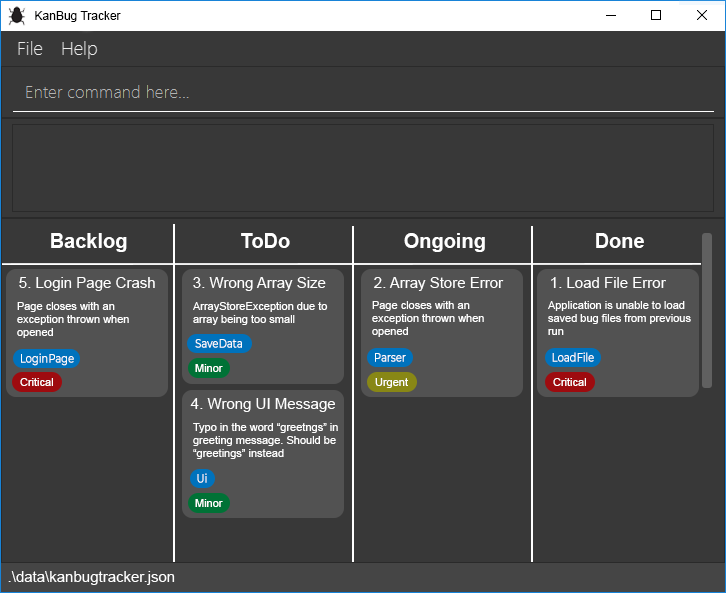
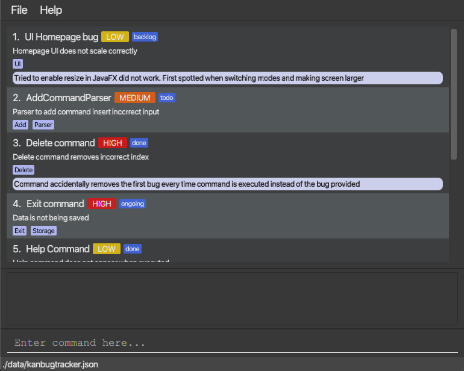

KanBug Tracker is a **desktop app for managing the tracking of bugs you encounter, optimized for use via a Command Line Interface (CLI)** while still having the benefits of a Graphical User Interface (GUI). If you can type fast, KanBug Tracker can get your bug management tasks done faster than traditional GUI apps.

Main View

ToDo View

* [Features](#features)
  * [Viewing help : **`help`**](#viewing-help--help)
  * [Listing all bugs : **`list`**](#listing-all-bugs--list)
  * [Adding a bug : **`add`**](#adding-a-bug--add)
  * [Deleting a bug : **`delete`**](#deleting-a-bug--delete)
  * [Editing a bug : **`edit`**](#editing-a-bug--edit)
  * [Moving a bug : **`move`**](#moving-a-bug--move)
  * [Exiting the program :  **`exit`**](#exiting-the-program--exit)
  * [Saving the data](#saving-the-data)
* [Command Summary](#command-summary)

  ---

## Features

- Words in `UPPER_CASE` are parameters to be supplied by the user
- Items in `[...]` are optional

### Viewing help : `help`
Gets a list of all commands that can be used.

Format: `help`
* Gets all commands’ syntax and usage.

### Listing all bugs : `list`
Lists all bugs in the tracker or bugs in a particular state

Format: `list [s/STATE]`
* Shows a list of bugs in the specified state or all bugs in the tracker system
* The state field is optional
* State can be either **backlog,todo,ongoing** or **done**

Examples:
* `list`, displays all the bugs in the tracker. 
* `list s/done`, displays a list of bugs in 'Done' state

### Adding a bug : `add`
Adds a bug to the list

Format: `add n/NAME d/DESCRIPTION [s/STATE]`
* Add a bug with the specified name, description and state to the bottom of the list.
* The state field is optional, all other fields are needed.
* If state is not specified, a default state of backlog will be assigned.

Examples:
* `add n/Print bug d/prints the wrong message s/todo`, adds a bug with name “Print Bug”, Description of “prints the wrong message” and state of “To do”.
* `add n/move bug d/moves bug to wrong column s/backlog`, adds a bug with name “move bug”, Description of “moves bug to wrong column” and state of “Backlog”.
* `add n/move bug d/UI`, adds a bug with name “move bug”, Description of “UI” and state of “Backlog”.

### Deleting a bug : `delete`
Deletes a bug from the list

Format: `delete INDEX`
  * Deletes the bug at the specified index  

Example:
  * `delete 1`, deletes the bug at index one of the bug list.

### Editing a bug : `edit`
Edits an existing bug in the tracker

Format: `edit INDEX [n/NEW_NAME] [d/NEW_DESCRIPTION]`

- Edits the bug at the specified `INDEX`. The index refers to the index number shown in the displayed list of bugs. The Index **must be a positive integer** 1,2,3...
- At least one of the optional fields must be provided.
- Existing values will be updated to the input values.

Examples:

- `edit 1 n/Wrong list numbers when displaying list d/List column printed as all 1's`, edits the name and description of the 1st bug to be "Wrong list numbers when displaying list" and "List column printed as all 1's" respectively.
- `edit 2 d/When listing items, duplicates are printed`, edits the description of the 2nd bug to be "When listing items, duplicated are printed".

### Moving a bug : `move`

Moves an existing bug in the tracker from one state to another

Format: `move INDEX s/STATE`

* Moves the bug at the specified `INDEX`. The index refers to the index number shown in the displayed list of bugs. The Index **must be a positive integer** 1,2,3…
* The state field is **mandatory** and must be provided.
* State can either be **backlog, todo, ongoing** or **done**.
* Existing state will be updated to the new state.

Examples:

* `move 1 s/todo`, moves the 1st bug from its initial state to the “To Do” state.
* `move 3 s/done`, moves the 3rd bug from its initial state to the “Done” state.

### Exiting the program :  `exit`
End and close the app.

Format: `exit`
* Saves all of the local data and exit.

### Saving the data : automatically
Data is saved into the hard disk everytime a change is made.

---

## Command Summary

|  Action  |  Format  |
|:--------:|:--------:|
|  **help**  |  `help`  |
|  **list**  |  `list [s/STATE]`  |
|  **add**  |  `add n/NAME d/DESCRIPTION s/STATE`  |
|  **delete**  |  `delete INDEX`  |
|  **edit**  |  `edit INDEX [n/NEW_NAME] [d/NEW_DESCRIPTION]`  |
|  **move**  |  `move INDEX s/STATE`  |
|  **exit**  |  `exit`  |

Team Name: AY2021S1-CS2103T-W17-1

