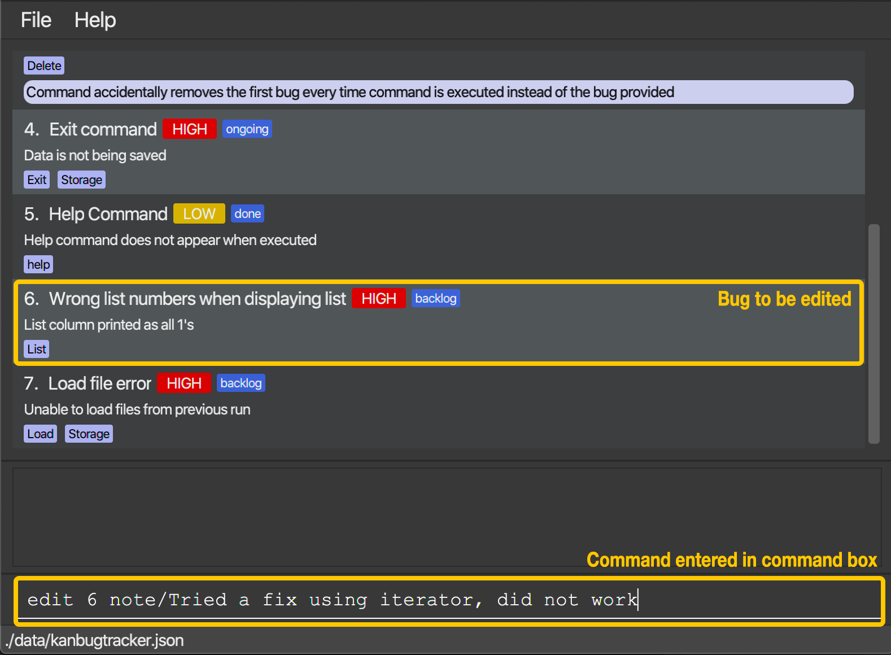
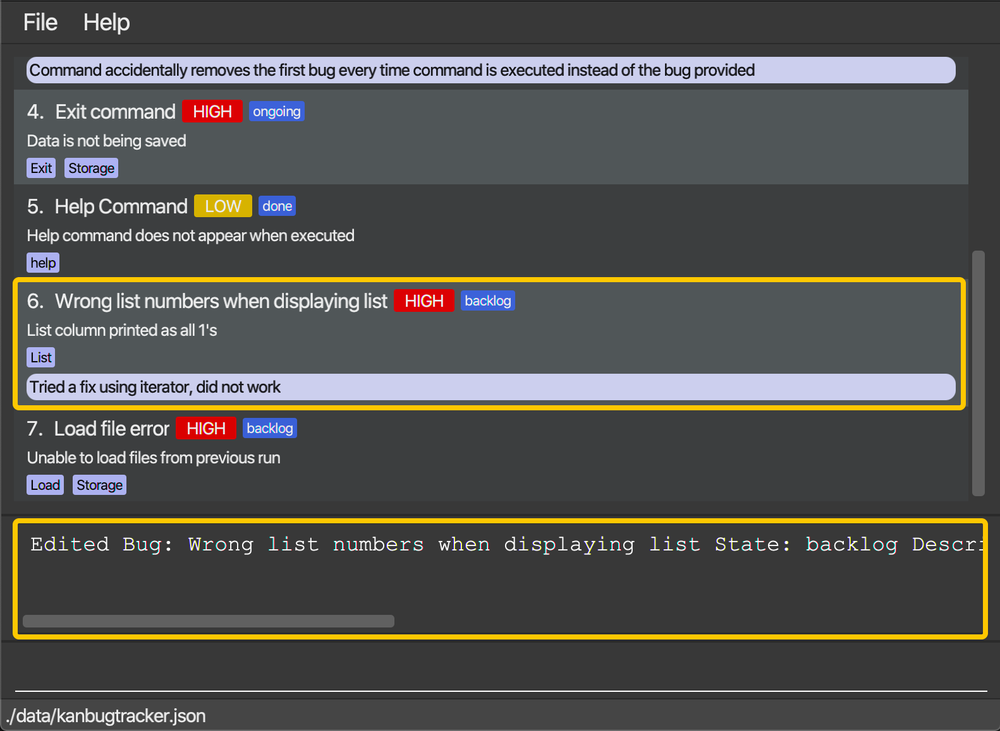
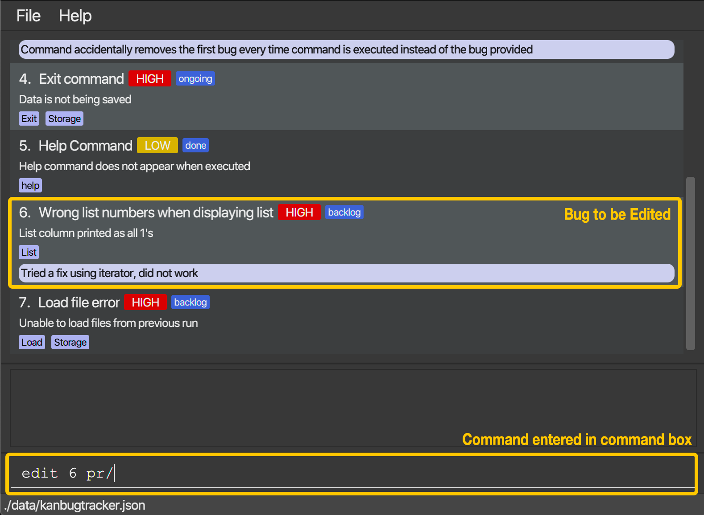
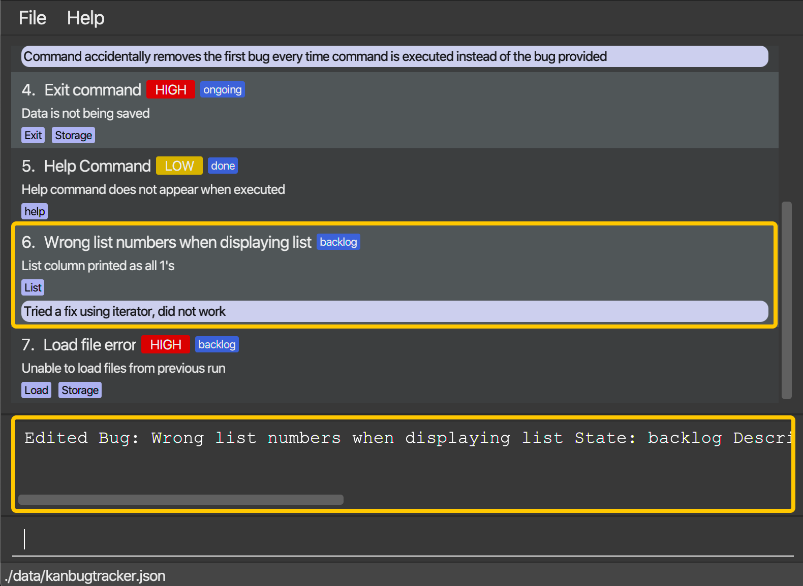

## What is KanBug Tracker?
KanBug Tracker is a **desktop application for managing the tracking of bugs you encounter, optimized for use via a Command Line Interface (CLI)** while still having the benefits of a Graphical User Interface (GUI). If you can type fast, KanBug Tracker can get your bug management tasks done faster than traditional GUI apps.

## Who is this application for?
KanBug Tracker was made to provide a lightweight, offline application for CS2103/T students to manage the bug details of their projects. Users interact with the application entirely through a CLI which makes the application perfect for fast typists. If you are looking for an offline, lightweight and easy-to-use application for your bug tracking needs, KanBug Tracker is the application for you!

## What can users expect?
KanBug Tracker provides two different views that the user can switch between. The first is the traditional Kanban board style view which aims to allow users to get a high-level overview of the state of bugs in their project. The second view is the To-Do list view which allows users to focus only on the bugs within a particular section of the KanBug Tracker.

#### Kanban View (default):

1. Command Line Interface for users to enter their commands
2. Display that the application uses to give feedback on commands to the user
3. Each individual bug will be displayed with the following data listed in order of display from top to bottom:
    - Name of bug
    - Priority of bug
    - Short description of bug
    - Relevant tags
4. Four of pre-declared states that KanBug Tracker comes with. Each bug will be assigned to one of the four states to aid users in tracking the life cycle of each bug.

#### List View:

1. Command Line Interface for users to enter their commands
2. Display that the application uses to give feedback on commands to the user
3. Scroll bar to navigate up and down the bug list
4. Each individual bug will be displayed with the following data listed in order of display from top to bottom and left to right:
    - Name of bug
    - Priority of bug
    - State of bug
    - Short description of bug
    - Relevant tags
    - Note containing extra information about the bug

## Table Of Contents

The first step in every journey is the preparation, after that when we have you all set up we will take you through some key points to aid you on your journey through our user guide. After which we will show you everything that you can do with this powerful tracker before we end off with some commands that will help you keep your bugs in order. Thank you for choosing KanBug Tracker!

1. [Getting Started](#1-getting-started)

2. [Glossary](#2-glossary)

   2.1 [What is a bug?](#21-what-is-a-bug)

   2.2 [What are commands?](#22-what-are-commands)

3. [Features](#3-features)

   3.1 [Switching Views : **`switch`**](#31-switching-views--switch)

   3.2 [Viewing help : **`help`**](#32-viewing-help--help)

   3.3 [Listing all bugs : **`list`**](#33-listing-all-bugs--list)

   3.4 [Searching for bugs: **`search`**](#34-searching-for-bugs--search)

   3.5 [Adding a bug : **`add`**](#35-adding-a-bug--add)

   3.6 [Deleting a bug : **`delete`**](#36-deleting-a-bug--delete)

   3.7 [Editing a bug : **`edit`**](#37-editing-a-bug--edit)

   3.8 [Editing a tag of a bug: **`editTag`**](#38-editing-a-tag-of-a-bug--edittag)

   3.9 [Adding a tag to a bug : **`addTag`**](#39-adding-a-tag-to-a-bug--addtag)

   3.10 [Moving a bug : **`move`**](#310-moving-a-bug--move)

   3.11 [Clearing all bugs: **`clear`**](#311-clearing-all-bugs--clear)

   3.12 [Exiting the program :  **`exit`**](#312-exiting-the-program--exit)

   3.13 [Saving the data](#313-saving-the-data--automatically)

4. [Command Summary](#4-command-summary)

------

## 1. Getting Started
1. Ensure that you have `Java 11` or above installed on your computer. If you do not have a suitable version of `Java` installed on your computer, you may head [here](https://www.oracle.com/java/technologies/javase-jdk11-downloads.html) to download the installer for your operating system.
2. Download the latest `KanBugTracker.jar` from our [GitHub](https://github.com/AY2021S1-CS2103T-W17-1/tp/releases)
    

  

3. Copy the `KanBugTracker.jar` file to a folder you want to use as your _root folder_.
    
    

:information_source: Note: In this instance, <b>Home Folder</b> acts as our <b>root folder</b>. Users are free to name their <b>root folder</b> however they wish. 

4. Double-click on the `KanBugTracker.jar`file to launch the application. You should see something similar.

   

The next section will cover the various terms that you need to be familiar with to get started!

## 2. Glossary

We're sure that you're excited to start using KanBug Tracker! Before that however, there are some terms that you need to be familiar with to make the best out of your KanBug Tracker experience.

We have divided this section into two. The first section introduces what a **bug is and explains its various parts**. The second section focuses on how the **user interacts with the application** and introduces some key ideas that users need to know.

### 2.1 What is a bug?

Bugs take centre stage in this application, after all, our purpose is to help you manage them! 

Let's look at the various parts of a bug to understand how they are represented in the application. 

​	

#### 1 - Bug Name

You get to choose what you want to name each bug you enter into the KanBug Tracker. No two bugs can have the same name.

#### 2 - Priority

When adding bugs to the KanBug Tracker, you can include a priority level for the bug. Priority levels help give you an indication of how urgently a particular bug has to be fixed. 

You choose from three pre-defined priority levels:

- **LOW**
- **MEDIUM**
- **HIGH**

#### 3 - State

Bugs in the KanBug Tracker can have one of four pre-defined states. States help you track which part of the bug's lifecycle a particular bug is in. 

The four available states are:

- **Backlog** - Bugs you have discovered but do not have the time to work on yet.
- **Todo** - Bugs you intend to work on now.
- **Ongoing** - Bugs you are currently working on.
- **Done** - Bugs that have been resolved.

[//]: # "-Add note about how the meanings of each state are iffy and users can use them however they feel is best"

#### 4 - Description

A short description detailing some key parts of the bug. Useful in helping you remember what the bug is about at a glance.

#### 5 - Tag

Multiple user-defined tags can be attached to each bug. Tags aid in helping you draw connections between multiple bugs. For instance, two bugs with the same tag **Ui** indicates that both bugs are related to the user-interface.

#### 6 - Notes

Notes are longer versions of descriptions. They are meant to provide more depth and can be used to log key pieces of information about the bug.

### 2.2 What are commands?

Commands are how you interact with the KanBug Tracker. The various commands will be covered in detail in the next [section](#3-features). However, there are some key parts of commands that you should take note of!

#### Columns

You may have noticed that some commands require you to provide the column that the bug is in. Don't fret, columns in the Kanban View simply refer to the state of a particular bug.

:information_source: Note: You only need to tell us the column when you are in <b>Kanban View</b>.
 
    • <b>List view:</b> You should not supply the <code>COLUMN</code>. The bug at the specified <code>INDEX</code> is edited. The index refers to the index number shown in the displayed list of bugs. 
    • <b>Kanban view:</b> Remember to supply the <code>COLUMN</code> when using this view! The bug you have chosen at <code>INDEX</code> in the <b>chosen column</b> is deleted. 
 
Example:  
  
The <b>highlighted bug is deleted</b> when command <code>delete 1</code> is executed  
 
  
The <b>highlighted bug is deleted</b> when command <code>delete 1 c/backlog</code> is executed 

#### Index

The index of a bug is the position of that bug in the list.

#### Prefixes

Some commands require the use of prefixes to indicate user input. Every command will have its own specific format so do pay close attention to the command's requirements!

:information_source: Note: If you accidentally include multiple copies of the same prefix, the programme will use the prefix that appears last.
Eg. <code>edit 1 n/firstname n/secondname</code> will result in the name of Bug 1 being editted to <b>secondname</b>.

:warning: WARNING: Using a prefix inside another prefix will result in it not being recognised by the application.
Eg. <code>d/t/Location</code> will result in the description field of the Bug being set to <code>t/Location</code>. 

## 3. Features

- Words in `UPPER_CASE` are parameters to be supplied by the user
- Items in `[...]` are **optional**
- Items in `(...)` are only required in **KanBan View**
- `INDEX` **must be a positive integer** 1,2,3...

### 3.1 Switching Views : `switch`

Want to get a high level overview of the bugs in your program or focus only on a particular column? Just switch views!

Format: `switch`
(Any parameters entered are ignored)

- Switches between **Kanban view** and **List view**

### 3.2 Viewing help : `help`

Not sure what to do next? Don't worry, just ask for help.

Format: `help` 
(Any parameters entered are ignored)

- Gets all commands’ syntax and the link to this User Guide.

Example: Stuck? Or just forgot what the commands are? Don't worry just do this:

Just type `help` and hit `Enter`

This creates a popup (the Help Window) with a command guide that you can refer to.

### 3.3 Listing all bugs : `list`

After running the search command you might want to see all the bugs you have in your Kanbug Tracker at one glance. Thats where the `list` can be used.

Format: `list`
(Any parameters entered are ignored)

- Shows all the bugs in your Kanbug Tracker

Example: Lets say you have just completed a search for bugs related to `list` using the command `search q/list` and now you want to view all your bugs again. Just do this:

Just type `list` and hit `Enter`

The result display will then indicate the result of your command, and the Kanbug Tracker will display all your bugs

### 3.4 Searching for bugs : `search`

When there are a lot of bugs in the tracker, the search command is here to help to find out particular bugs you are looking for.

Format: `search q/QUERYSTRING`

- This command sorts out bugs based on your given query-string. The tracker returns all the bugs that has either name or description or tags containing this query-string as a substring. 
- The query-string cannot be empty and case-insensitive.
- If there are repetitive `q/` prefixes, the tracker only considers the last one.

Examples:

- `search q/frontend`, returns a list of bugs of which either name or description or tags contains query-string **frontend** (case-insensitive) in the words.

### 3.5 Adding a bug : `add`

When a bug is encountered, the add command is here to help keep track of the bug for future reference.

Format: `add n/NAME d/DESCRIPTION [s/STATE] [note/NOTE] [t/TAG] [pr/PRIORITY]`

- Add a bug with the specified name, description and state to the bottom of the list.
- The state, note and tag fields are optional, all other fields are needed.
- If state is not specified, a default state of backlog will be assigned.
- The command will fail if a bug with the same name already exists.

Examples:

Suppose you enountered a bug that is not too urgent for now, it would be a good idea to put the bug in the backlog with a priority of low.

You can type `add n/Ui bug d/Homepage not loading properly s/backlog pr/low` and press `Enter`.

Once the command has been entered, the result display shows the result of your command and Kanbug tracker
add the bug to the bottom of the list.

:warning: WARNING: Do note that for the following commands (Section 3.6 - 3.10) you have to include the <code>c/COLUMN</code> prefix when using it in the <b>Kanban View</b> which should not be added when using it in the <b>List View</b>.

### 3.6 Deleting a bug : `delete`

After a bug is fixed and a project is done, its time to remove the bug from the application.

Format: `delete INDEX (c/COLUMN)`

- Deletes the bug at the specified index

Example:
Suppose you fixed a bug and want to clear some space. This is how you can do it:

You can type `delete 3` and press `Enter`.

Once the command has been entered, the result display shows the result of your command and Kanbug tracker
will remove the bug at the specified index.
### 3.7 Editing a bug : `edit`

Made a mistake when adding in a bug or simply changed your mind on what the description should be? Fret not, that's what the edit command is for.

Format: `edit INDEX (c/COLUMN) [n/NEW_NAME] [d/NEW_DESCRIPTION] [s/NEW_STATE] [note/NEW_NOTE] [t/NEW_TAG] [pr/NEW_PRIORITY]`

- Edits the specified bug.
- At least one of the optional fields must be provided.
- Existing values will be updated to the input values.
- **Multiple tags** can be added or edited.
- The command will fail if the operation results in duplicated bugs (bugs with the same name).

:information_source: Note: To remove optional fields such as <code>Priority</code> and <code>Note</code> simply type the prefix without providing anything after.
Eg. <code>edit 1 pr/</code> will remove the assigned priority of the Bug if there is one present.

Examples:

Example 1: Suppose you incorrectly named a bug and provided it with an inaccurate description as well as priority and want to change the name of the bug to **Wrong list numbers when displaying list**, the description to **List column printed as all 1's** and priority to **high**:

You can type `edit 6 n/Wrong list numbers when displaying list d/List column printed as all 1's pr/high` and press `Enter`.

Once the command has been entered, the result display shows the result of your command and the Kanbug tracker has been updated with the updated name, description as well as priority.

Example 2: Perhaps then you tried some ways to fix it that didn't work so you want to add a `note` of **Tried a fix using iterator, did not work**. This is how you can do it:

Type `edit 6 note/Tried a fix using iterator, did not work` as input and press `Enter`.

Once the command has been entered, the result display shows the result of your command and the Kanbug tracker has been updated with the updated note.

Example 3: After toiling away at the bug, you realise that you have solved it! So now you want to remove the `priority` of the Bug. This is how you can do it:

Type `edit 6 pr/` as input and press `Enter`.

Once the command has been entered, the result display shows the result of your command and the Kanbug tracker has been updated with the priority of the bug removed.

### 3.8 Editing a tag of a bug : `editTag`

Made a mistake when adding tags to your bug? With this command, you can easily make amends without having to retype every single tag!

Format: `editTag INDEX [c/COLUMN] ot/OLD_TAG nt/NEW_TAG`

- The command to be used depends on which view the user is in. The user can either be in **Kanban view** or **List view**.
  - **Kanban view**: User must supply `COLUMN`. The bugs are filtered such that only bugs that have a `STATE` matching the `COLUMN` selected are considered. The bug at the specified `INDEX` of this filtered list is selected to be edited.
  - **List view**: `COLUMN` should **not** be supplied. The bug at the specified `INDEX` is edited. The index refers to the index number shown in the displayed list of bugs.
  
- The `OLD_TAG` supplied must be an existing tag.
- The `NEW_TAG` supplied must **not** be an existing tag.
- The `OLD_TAG` will be updated to the `NEW_TAG`

Examples:

- `editTag 1 ot/UI nt/UserDisplay` edits the bug at index **1** and replaces the tag **UI** with the tag **UserDisplay**.
- `editTag 1 c/backlog ot/CommandResult nt/CommandParser` filters all bugs and only considers those that have a **state** of **backlog**. It then edits the bug at index **1** of this list and replaces the tag **CommandResult** with the tag **CommandParser**.

### 3.9 Adding a tag to a bug : `addTag`

Forgot to add a tag to one of your bugs? Or perhaps you want to add a new one? With this command, adding tags has never been simpler!

Format: `addTag INDEX [c/COLUMN] nt/NEW_TAG`

- The command to be used depends on which view the user is in. The user can either be in **Kanban view** or **List view**.
  - **Kanban view**: User must supply `COLUMN`. The bugs are filtered such that only bugs that have a `STATE` matching the `COLUMN` selected are considered. The bug at the specified `INDEX` of this filtered list is selected to be edited.
  - **List view**: `COLUMN` should **not** be supplied. The bug at the specified `INDEX` is edited. The index refers to the index number shown in the displayed list of bugs.

- The `NEW_TAG` supplied must **not** be an existing tag.
- The `NEW_TAG` will be added to the bug.

Examples:

- `addTag 2 nt/UserDisplay` edits the bug at index **2** and adds the tag **UI** to the bug.
- `addTag 1 c/backlog nt/CommandParser` filters all bugs and only considers those that have a **state** of **backlog**. It then edits the bug at index **1** of this list and adds the tag **CommandParser** to the bug.

### 3.10 Moving a bug : `move`

Whether you begin to work on a bug, finish fixing one or plan to deal with a bug later, you can use `move` to update the 
progress on dealing with that bug.

Format: `move INDEX [c/COLUMN] s/STATE`

- The command to be used depends on which view the user is in. The user can either be in **Kanban view** or **List view**.
  - **Kanban view**: User must supply `COLUMN`. The bugs are filtered such that only bugs that have a `STATE` matching the `COLUMN` selected are considered. The bug at the specified `INDEX` of this filtered list is selected to be edited.
  - **List view**: `COLUMN` should **not** be supplied. The bug at the specified `INDEX` is edited. The index refers to the index number shown in the displayed list of bugs.

- Specifically, this command will change the state of the bug.
- The state field is **mandatory** and must be provided.
- State can either be **backlog, todo, ongoing** or **done**.
- If the **destination** state is the same with the initial state of the bug, no change will be made.
- The bug must exist to be moved (e.g. we cannot move the fifth bug in the List view if there are only four bugs).

Examples:

- `move 1 s/todo`, moves the first bug in the List view from its initial state to the **Todo** state.
- `move 3 c/ongoing s/done`, moves the bug third bug in the Ongoing column of Kanban view from its initial state
 (Ongoing) to the **Done** state.

### 3.11 Clearing all bugs : `clear`

Imagine the project you just finish ends up with a hundred of bug records in the tracker. How to restart? Don't worry! Clear command is here to help you to clear all bugs to reinitialize the application.

Format: `clear`
(Any parameters entered are ignored)

- This command is applicable to both Kanban and List views.

### 3.12 Exiting the program : `exit`

Ends and closes the app.

Format: `exit`
(Any parameters entered are ignored)

When you are done with managing your tasks, use this command to saves all of the local data and exit from the app. 
Alternatively, you can also close the window directly or press Esc key, and the app will do the same thing.

### 3.13 Saving the data : automatically

Data is saved into the hard disk every time a change is made.

------

## 4. Command Summary

|   Action    |                            Format                            |
| :---------: | :----------------------------------------------------------: |
|  **help**   |                            `help`                            |
|  **list**   |                            `list`                            |
| **search**  |                      `search q/QUERYSTRING`                  |
|   **add**   |   `add n/NAME d/DESCRIPTION [s/STATE] [note/NOTE] [t/TAG] [pr/PRIORITY]`   |
| **delete**  |                        `delete INDEX (c/COLUMN)`                        |
|  **edit**   | `edit INDEX (c/COLUMN) [n/NEW_NAME] [d/NEW_DESCRIPTION] [s/NEW_STATE] [note/NEW_NOTE] [t/NEW_TAG] [pr/NEW_PRIORITY]` |
| **editTag** |       `editTag INDEX (c/COLUMN) ot/OLD_TAG nt/NEW_TAG`       |
| **addTag**  |             `addTag INDEX (c/COLUMN) nt/NEW_TAG`             |
|  **move**   |               `move INDEX (c/COLUMN) s/STATE`                |
|  **clear**  |                            `clear`                           |
|  **exit**   |                            `exit`                            |

[Back to top](#what-is-kanbug-tracker)

Team Name: AY2021S1-CS2103T-W17-1
