## Table Of Contents

1. [Introduction](#1-introduction)

2. [How do I use this User Guide?](#2-how-do-i-use-this-user-guide)

3. [Getting Started](#3-getting-started)

4. [Understanding KanBug Tracker](#4-understanding-kanbug-tracker)

   4.1 [Understanding the Graphical User Interface](#41-understanding-the-graphical-user-interface)

   4.2 [What is a bug?](#42-what-is-a-bug)

   4.3 [What are commands?](#43-what-are-commands)

5. [Features](#5-features)

   5.1 [Switching Views : **`switch`**](#51-switching-views--switch)

   5.2 [Viewing help : **`help`**](#52-viewing-help--help)

   5.3 [Searching for bugs: **`search`**](#53-searching-for-bugs--search)

   5.4 [Listing all bugs : **`list`**](#54-listing-all-bugs--list)

   5.5 [Adding a bug : **`add`**](#55-adding-a-bug--add)

   5.6 [Deleting a bug : **`delete`**](#56-deleting-a-bug--delete)

   5.7 [Editing a bug : **`edit`**](#57-editing-a-bug--edit)

   5.8 [Editing a tag of a bug: **`editTag`**](#58-editing-a-tag-of-a-bug--edittag)

   5.9 [Adding a tag to a bug : **`addTag`**](#59-adding-a-tag-to-a-bug--addtag)

   5.10 [Moving a bug : **`move`**](#510-moving-a-bug--move)

   5.11 [Clearing all bugs: **`clear`**](#511-clearing-all-bugs--clear)

   5.12 [Exiting the program :  **`exit`**](#512-exiting-the-program--exit)

   5.13 [Saving the data](#513-saving-the-data--automatically)

6. [Command Summary](#6-command-summary)

## 1. Introduction

Are you struggling to find an effective way to keep track of and manage the bugs you encounter while programming?

Perhaps you're still relying on the archaic method of pen and paper? Or you cannot wrap your head around the unnecessarily complex features of existing bug trackers?

Do you desire an offline solution that is easy to use yet powerful enough to solve all your bug management problems? Look no further because we have the perfect product for you.

Introducing KanBug Tracker, a revolutionary bug management application!

Let's look at some ways that KanBug Tracker can benefit you:

- **Bug Management**: Store and organise all the bugs you encounter while programming with a few simple commands. 
- **Visualisation**: Our intuitive layout is designed to give you a high-level overview of your bug fixing progress, giving you the ability to plan your approach like never before.
- **Incredible Portability**: The application lives entirely on your computer and does not require an internet connection, allowing you to manage your bugs wherever you are.
- **Powerful features**: Take your bug tracking efforts to the next level with features that will allow you to search for bugs and move them between states.
- **Performance**: KanBug Tracker is powered by a slick Command Line Interface (CLI) designed to maximise your productivity with its high responsiveness.

As you can see, KanBug Tracker was designed with developers like you in mind, with powerful features that help you stay on top of your bug fixing process. Never again will you have to struggle with your bug management!

## 2. How do I use this User Guide?

The team here at KanBug Tracker has broken down this User Guide into easy to understand sections that will help to answer any questions you have pertaining to our application.

Before continuing, it would be good to familiarise yourself with a few symbols that you will encounter in this User Guide:

:information_source: Note: This provides you with additional information that you should take note of. 

:warning: WARNING: Watch out for warnings! They tell you important information that you NEED to know! 

:bulb: Tip: This provides you with tips and tricks or some context behind the feature.

Now you're all set to get started! But where should you begin?

- If you are a first-time user, start [here](#3-getting-started) by learning how to download and set up KanBug Tracker.
- If you are confused about the various parts of KanBug Tracker (Graphical user interface, what is a bug, etc.), you can learn about them [here](#4-understanding-kanbug-tracker).
- If you are interested to learn about the different exciting features KanBug Tracker has, check out the Features section [here](#5-features).
- If you are already familiar with KanBug Tracker but have some trouble remembering the command format, take a look at the Command Summary section [here](#6-command-summary).

## 3. Getting Started

1. Ensure that you have `Java 11` or above installed on your computer. If you do not have a suitable version of `Java` installed on your computer, you may head [here](https://www.oracle.com/java/technologies/javase-jdk11-downloads.html) to download the installer for your operating system.

   

2. Download the latest `KanBugTracker.jar` from our [GitHub](https://github.com/AY2021S1-CS2103T-W17-1/tp/releases)

   

3. Copy the `KanBugTracker.jar` file to a folder you want to use as your _root folder_.

   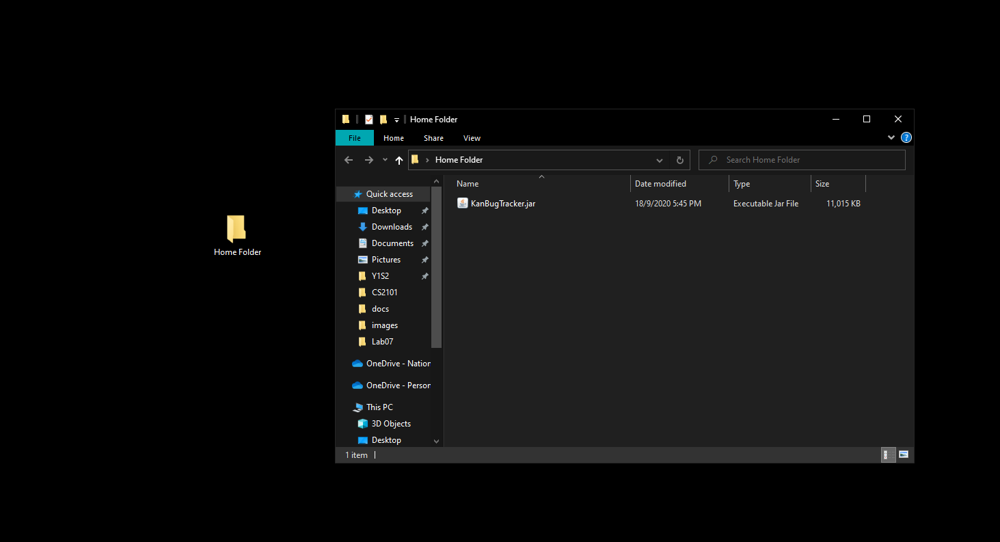
   
   
:information_source: Note: In this instance, <b>Home Folder</b> acts as our <b>root folder</b>. Users are free to name their <b>root folder</b> however they wish. 
   

4. Double-click on the `KanBugTracker.jar` file to launch the application. You should see something similar.

   

5. Now that you're all set up, you're ready to take your bug management to the next level! 

   You can start getting familiar with the various commands that KanBug Tracker has to offer.	

   - You can get an in-depth explanation of the various features that KanBug Tracker has to offer [here](#5-features).
   - To get a summary of all the commands, refer [here](#6-command-summary).

## 4. Understanding KanBug Tracker

We're sure that you're excited to start using KanBug Tracker! Before that however, there are some terms and parts of the application that you need to be familiar with to make the best out of your KanBug Tracker experience.

We have divided this section into three. The first subsection introduces the various aspects of KanBug Tracker's **Graphical User Interface (GUI)**. The second subsection explains what a **bug is and explains its various parts**. The third subsection focuses on how the **user interacts with the application** and introduces some key ideas that users need to know.

### 4.1 Understanding the Graphical User Interface

KanBug Tracker provides two different views that the user can switch between. The first is the traditional Kanban board style view which aims to allow users to get a high-level overview of the state of bugs in their project. The second view is the List view which allows users to focus only on the bugs within a particular section of the KanBug Tracker.

#### Kanban View (default):
   
​	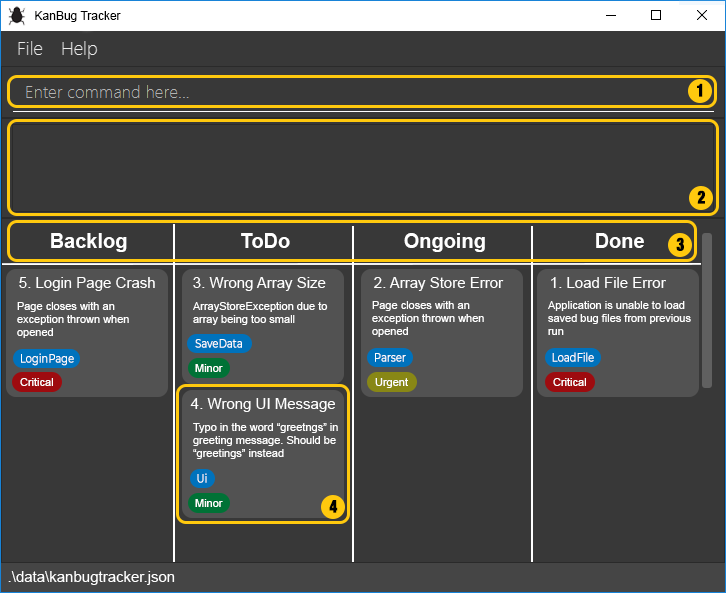

1. Command Line Interface for users to enter their commands
2. Display that the application uses to give feedback on commands to the user
3. Each individual bug will be displayed with the following data listed in order of display from top to bottom:
   - Name of bug
   - Priority of bug
   - Short description of bug
   - Relevant tags
4. Four of pre-declared states that KanBug Tracker comes with. Each bug will be assigned to one of the four states to aid users in tracking the life cycle of each bug.

#### List View:

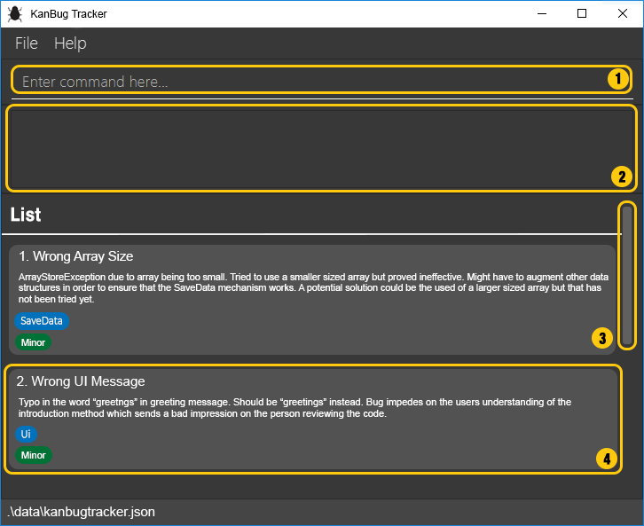

1. Command Line Interface for users to enter their commands
2. Display that the application uses to give feedback on commands to the user
3. Scroll bar to navigate up and down the bug list
4. Each individual bug will be displayed with the following data listed in order of display from top to bottom and left to right:
   - Name of bug
   - Priority of bug
   - State of bug
   - Short description of bug
   - Relevant tags
   - Note containing extra information about the bug

### 4.2 What is a bug?

By now, you've probably seen the word **bug** a lot. But what exactly is a bug and what are the various parts of it you have to know? Let's take a look and find out.

#### 1 - Bug Name

You get to choose what you want to name each bug you enter into the KanBug Tracker. No two bugs can have the same name.

#### 2 - Priority

When adding bugs to the KanBug Tracker, you can include a priority level for the bug. Priority levels help give you an indication of how urgently a particular bug has to be fixed. 

You choose from three pre-defined priority levels:

- **LOW**
- **MEDIUM**
- **HIGH**

#### 3 - State

Bugs in the KanBug Tracker can have one of four pre-defined states. States help you track which part of the bug's lifecycle a particular bug is in. 

The four available states are:

- **Backlog** - Bugs you have discovered but do not have the time to work on yet.
- **Todo** - Bugs you intend to work on next.
- **Ongoing** - Bugs you are currently working on.
- **Done** - Bugs that have been resolved.

:bulb: Tip: The meanings of the states are not fixed. You are free to interpret them in any way that best suits you.

#### 4 - Description

A short description detailing some key parts of the bug. Useful in helping you remember what the bug is about at a glance.

#### 5 - Tag

Multiple user-defined tags can be attached to each bug. Tags aid in helping you draw connections between multiple bugs. For instance, two bugs with the same tag **Ui** indicates that both bugs are related to the user-interface.

#### 6 - Notes

Notes are longer versions of descriptions. They are meant to provide more depth and can be used to log key pieces of information about the bug.

### 4.3 What are commands?

Commands are how you interact with the KanBug Tracker. The various commands will be covered in detail in the next [section](#5-features). However, there are some key parts of commands that you should take note of!

#### Columns

You may notice that some commands require you to provide the column that the bug is in. Don't fret, columns in the Kanban View simply refer to the state of a particular bug.

:information_source: Note: You only need to supply the column when you are in <b>Kanban View</b>.
  
   • <b>List view:</b> You should not supply <code>COLUMN</code>. The bug at the specified <code>INDEX</code> is deleted. The index refers to the index number shown in the displayed list of bugs. 
   • <b>Kanban view:</b> Remember to supply <code>COLUMN</code> when using this view! The bug you have chosen at <code>INDEX</code> in the <b>chosen column</b> is deleted. 
 
Example:   
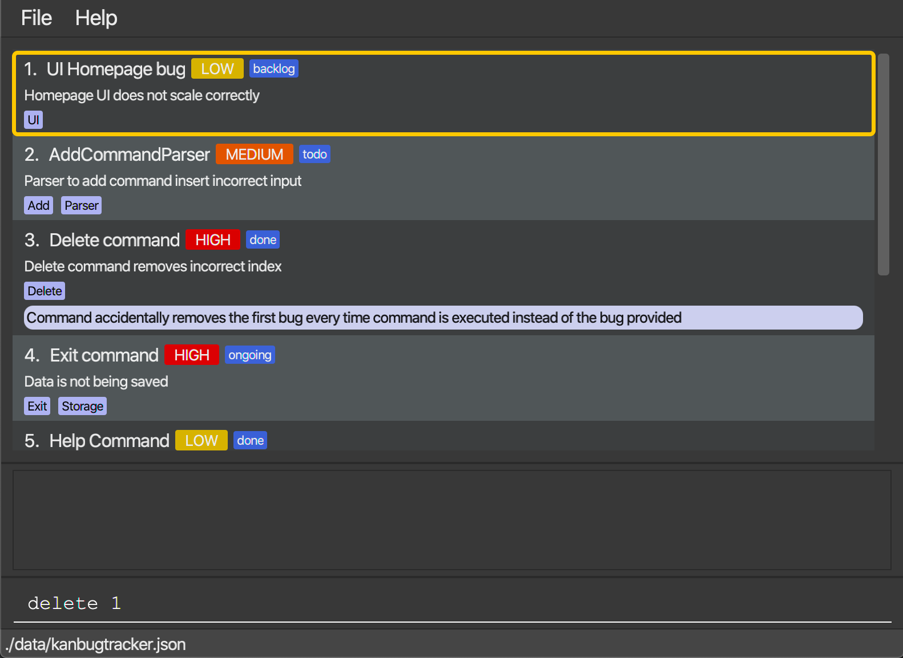   
The <b>highlighted bug is deleted</b> when command <code>delete 1</code> is executed in <b>List View</b>. 
 
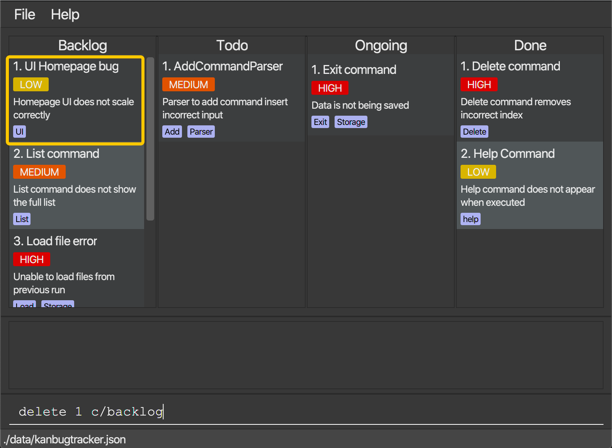   
The <b>highlighted bug is deleted</b> when command <code>delete 1 c/backlog</code> is executed in <b>Kanban View</b>. 

#### Index

The **index** of a bug is the position of that bug in the list.

#### Prefixes

Some commands require the use of prefixes to indicate user input. Every command will have its own specific format so do pay close attention to the command's requirements!

:information_source: Note: If you accidentally include multiple copies of the same prefix, the programme will consider only the prefix that appears last and ignore all previous ones, 
even if they are of the wrong format, e.g. <code>edit 1 n/@wrong format n/firstname n/secondname</code> will result in the name of Bug 1 being edited to <b>secondname</b>.

:warning: WARNING: A prefix is only valid if it is preceded by a space and is mentioned in the command format, otherwise it is treated as a normal word, 
e.g. <code>d/t/Location v/not a prefix</code> will result in the description field of the Bug being set to <code>t/Location v/not a prefix</code> because neither "t/" nor "v/" is considered a prefix. 

## 5. Features

- Words in `UPPER_CASE` are parameters to be supplied by the user
- Items in `[...]` are **optional**
- Items in `(...)` are only required in **Kanban view** and should not be supplied in **List view**
- `INDEX` **must be a positive integer** 1,2,3...

:warning: WARNING: Prefixes surrounded by parentheses in the command format are considered invalid in List view, 
e.g. executing <code>edit 1 d/column c/todo</code> in List view will not result in the description field of the Bug being set to <code>column c/todo</code> but will result in an error because "c/" is considered as a prefix which should not be supplied in List view. 

### 5.1 Switching Views : `switch`
(by Rishabh)

Want to get a high level overview of the bugs in your program or focus only on a particular column? Just switch views!

Format: `switch`

- Switches between **Kanban view** and **List view**

Example: Want to jump into **List view** after launching the app? Do this:

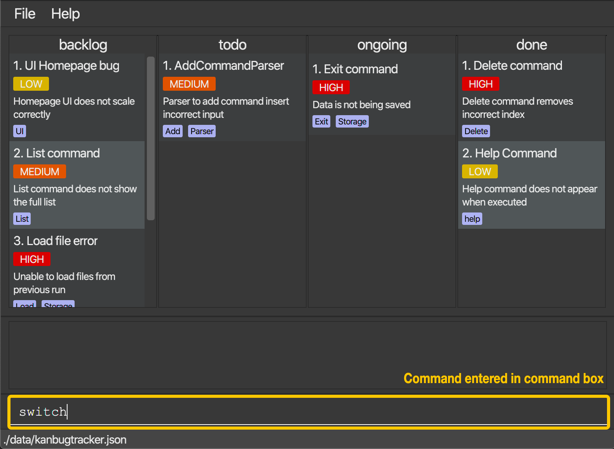

Just type `switch` and hit `Enter`

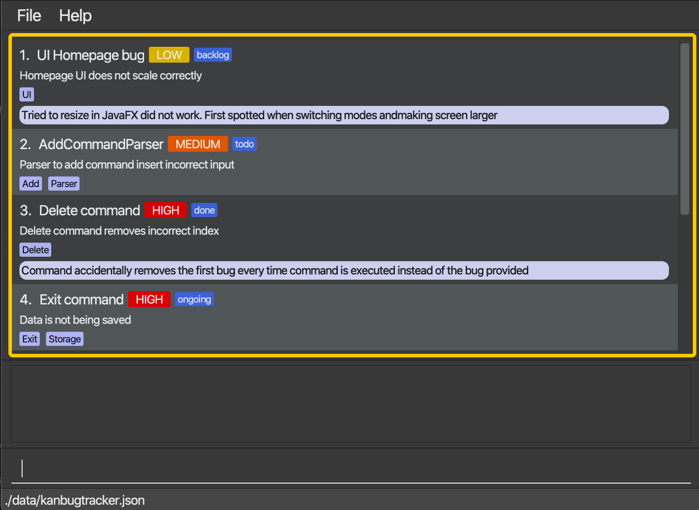

This switches you from the original **Kanban view** to the **List view**!

:bulb: Tip: If you execute this command in <b>List view</b> it will run in exactly the same way just in reverse!

### 5.2 Viewing help : `help`
(by Rishabh)

Not sure what you can do next? Don't worry, just ask for help.

Format: `help` 

- Gets all commands’ format and the link to this User Guide.

Example: Stuck? Or just forgot what the commands are? Don't worry just do this:

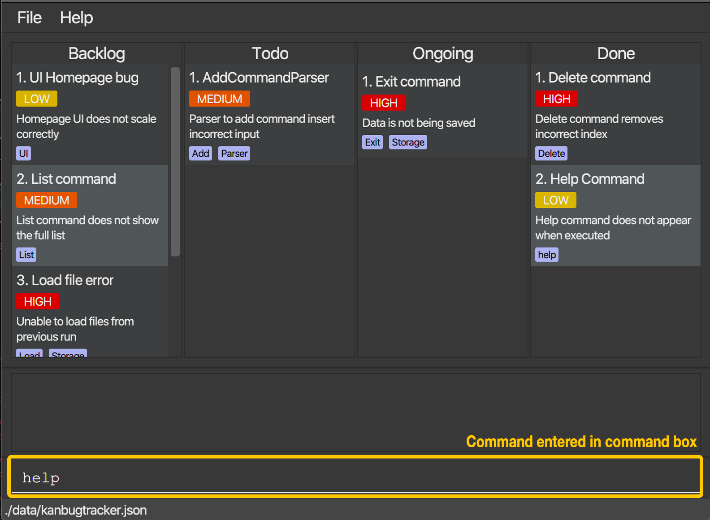

Just type `help` and hit `Enter`

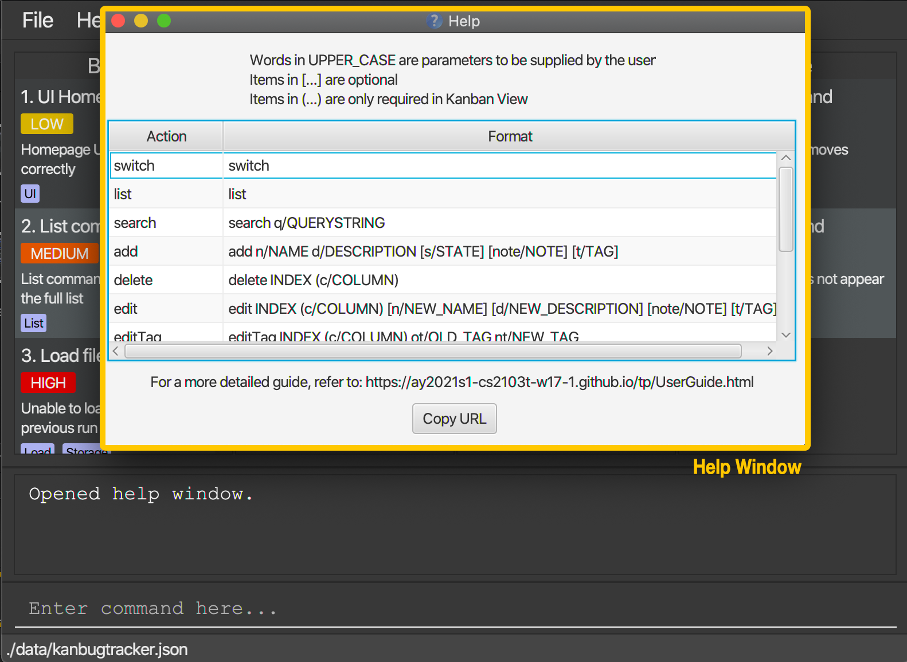

This creates a popup (the Help Window) with a command guide that you can refer to.

:bulb: Tip: You can also press the <code>F1</code> key to open the Help window. Try it!

### 5.3 Searching for bugs : `search`
(by Duy)

When there are a lot of bugs in the tracker, you might want to look for a particular one, `search` command is here to help you with that!

Format: `search q/QUERYSTRING`

:information_source: Note: Are you wondering what <code>QUERYSTRING</code> is? <code>QUERYSTRING</code> refers to your keyword input (that can be <b>one</b> word or <b>multiple</b> words) to find matches when the <code>search</code> command is executed.

- This command sorts out bugs based on your given `QUERYSTRING`. The tracker returns all the bugs that contain the `QUERYSTRING` as either the name, description or tag.

:information_source: Note: The <code>QUERYSTRING</code> that you type in is <b>case-insensitive</b>. If you accidentally type in more than one <code>q/</code> prefix, only the last one will be used to filter the list. The format of <code>search</code> command in both <b>Kanban</b> view and <b>List</b> view is the same.

:warning: WARNING: Watch out! If you use this command without providing any keywords (i.e. with an <b>EMPTY</b> <code>QUERYSTRING</code>), you will see an error reminding you that the Kanbug Tracker will not accept it.

 
Example:

Suppose you want to look for bugs in the tracker that match the term `command`. Firstly, you type in the command box as follows:

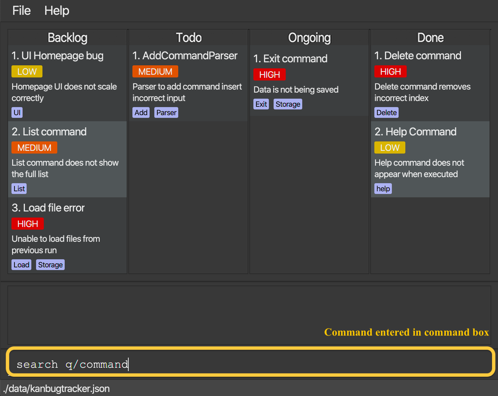

Once the command has been entered, the result display will show the total number of relevant items and the KanBug Tracker will display all these bugs as a list in each state.

If either the name, description or tag of a bug contains the `QUERYSTRING`, it will be included in the resulting list after the command has been executed.

### 5.4 Listing all bugs : `list`
(by Rishabh)

After running the search command you might want to see all the bugs you have in your KanBug Tracker at one glance. Thats where `list` can be used.

Format: `list`

- Shows all the bugs in your KanBug Tracker

Example: Lets say you have just completed a search for bugs related to `Parser` using the command `search q/Parser` and now you want to view all your bugs again. Just do this:

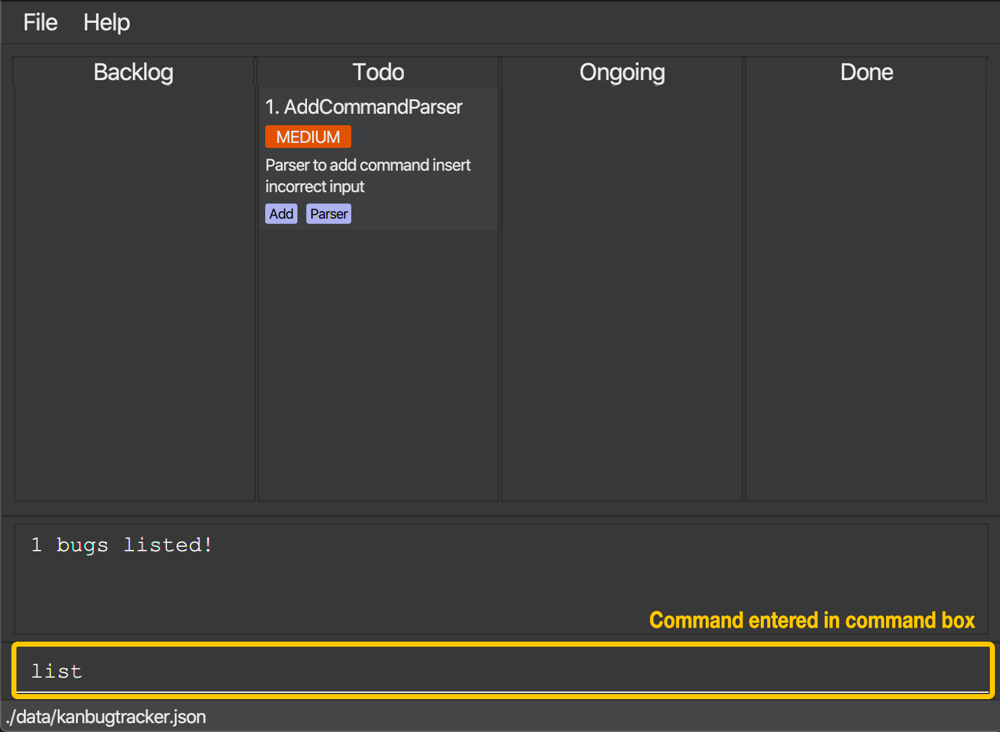

Just type `list` and hit `Enter`

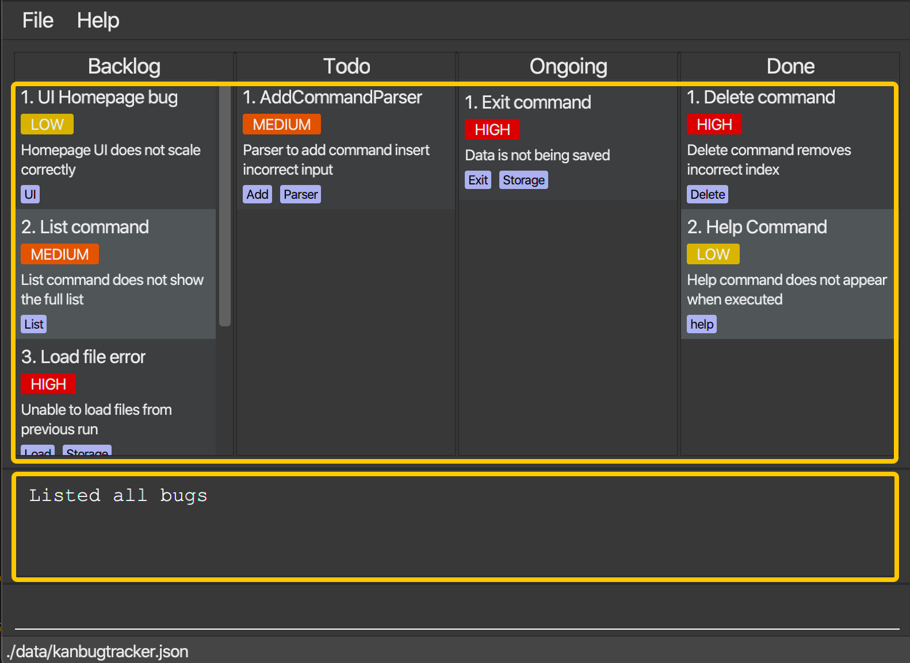

The result display will then indicate the result of your command, and the KanBug Tracker will display all your bugs.

### 5.5 Adding a bug : `add`
(by Roger)

Noticed a bug while coding? The add command is here to help keep track of the bug for future reference.

Format: `add n/NAME d/DESCRIPTION [s/STATE] [note/NOTE] [t/TAG] [pr/PRIORITY]`

- Add a bug with the specified name, description and state to the bottom of the list.
- The state, note and tag fields are optional, all other fields are needed.
- If state is not specified, a default state of **backlog** will be assigned.
- The command will fail if a bug with the same name already exists.

Examples:

Suppose you encounter a bug that is not too urgent at the moment, it would be a good idea to put the bug in the backlog with a priority of low.

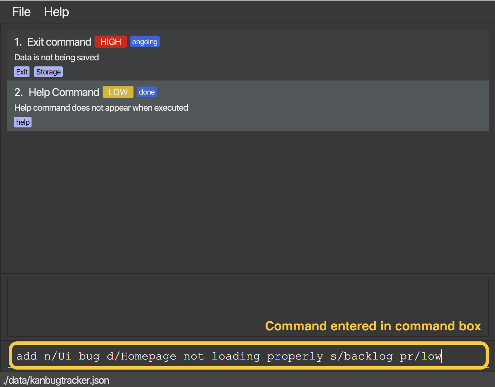

You can type `add n/Ui bug d/Homepage not loading properly s/backlog pr/low` and press `Enter`.

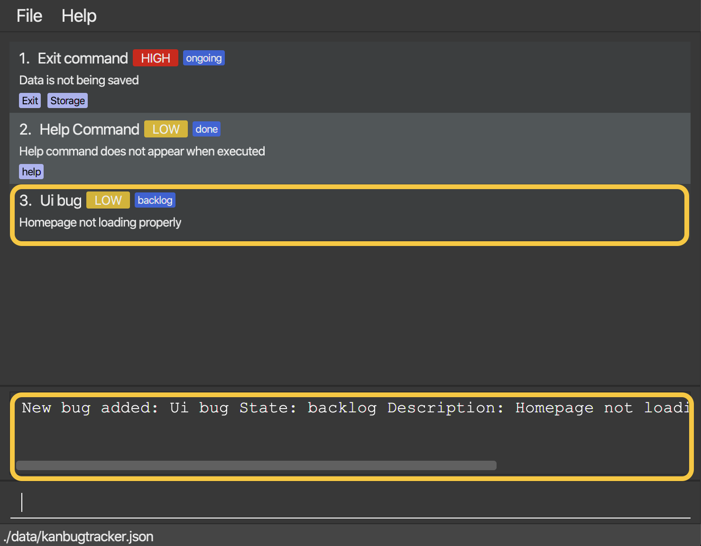

Once the command has been entered, the result display shows the result of your command and KanBug Tracker
adds the bug to the bottom of the list.

### A word of caution

:warning: WARNING: Do note that for the following commands (Section 5.6 - 5.10) you have to include the <code>c/COLUMN</code> when in <b>Kanban View</b>. The <code>c/COLUMN</code> should <b>not</b> be used when in <b>List View</b>.    If you are unsure about what this means, an explanation on columns and how to navigate commands in Kanban view was provided <a href = "#43-what-are-commands">here</a>.    Additionally, most walkthroughs will only be given for command usage in <b>List View</b> as the only difference in <b>Kanban View</b> is the need to supply <code>c/COLUMN</code>.

### 5.6 Deleting a bug : `delete`
(by Roger)

After a bug is fixed and a project is done, its time to remove the bug from the tracker.

Format: `delete INDEX (c/COLUMN)`

- Deletes the bug at the specified index

Example:
Suppose you fixed a bug and want to clear some space. This is how you can do it:

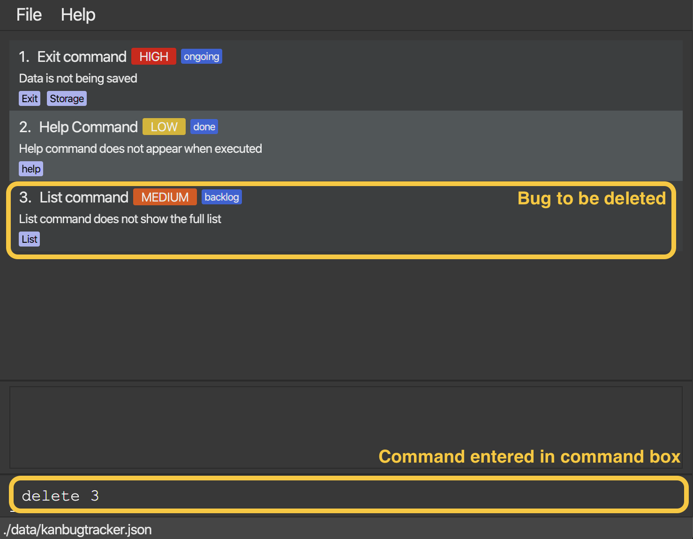

Just type `delete 3` and press `Enter`.

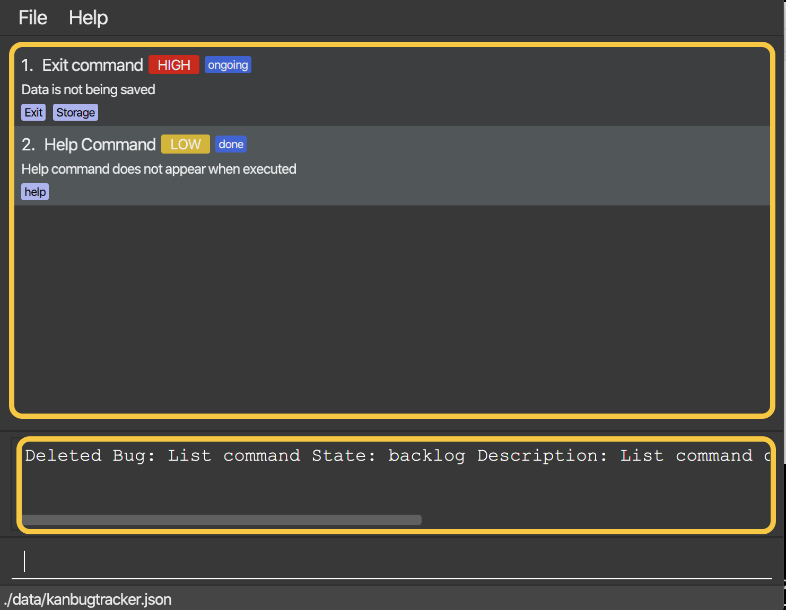

Once the command has been entered, the result display shows the result of your command and KanBug Tracker will remove the bug at the specified index.

### 5.7 Editing a bug : `edit`
(by Rishabh)

Made a mistake when adding in a bug or simply changed your mind on what the description should be? Fret not, that's what the edit command is for.

Format: `edit INDEX (c/COLUMN) [n/NEW_NAME] [d/NEW_DESCRIPTION] [s/NEW_STATE] [note/NEW_NOTE] [t/NEW_TAG] [pr/NEW_PRIORITY]`

- Edits the specified bug.
- At least one of the optional fields must be provided.
- Existing values will be updated to the input values.
- **Multiple tags** can be added or edited.
- The command will fail if the operation results in duplicated bugs (bugs with the same name).

:information_source: Note: To remove optional fields such as <code>Note</code>, <code>Tags</code> and <code>Priority</code> from a bug simply type the prefix without providing anything after, 
e.g. <code>edit 1 pr/</code> will remove the assigned priority of the Bug if there is one present.

:warning: WARNING: Watch out! If you use this command to edit Tags you will erase all pre-existing tags from the bug you have selected and replace them with the new tags you have specified! To modify a specific bug without affecting the others use the <a href="#58-editing-a-tag-of-a-bug--edittag">editTag</a> command instead.  
Example: If the Bug at index 1 has tags <code>Ui</code> and <code>List</code> and we execute <code>edit 1 t/Edit</code>, the Bug will then have just 1 tag named <code>Edit</code>.
 

Examples:

Example 1: Suppose you incorrectly named a bug and provided it with an inaccurate description as well as priority and want to change the name of the bug to **Wrong list numbers when displaying list**, the description to **List column printed as all 1's** and priority to **HIGH**:

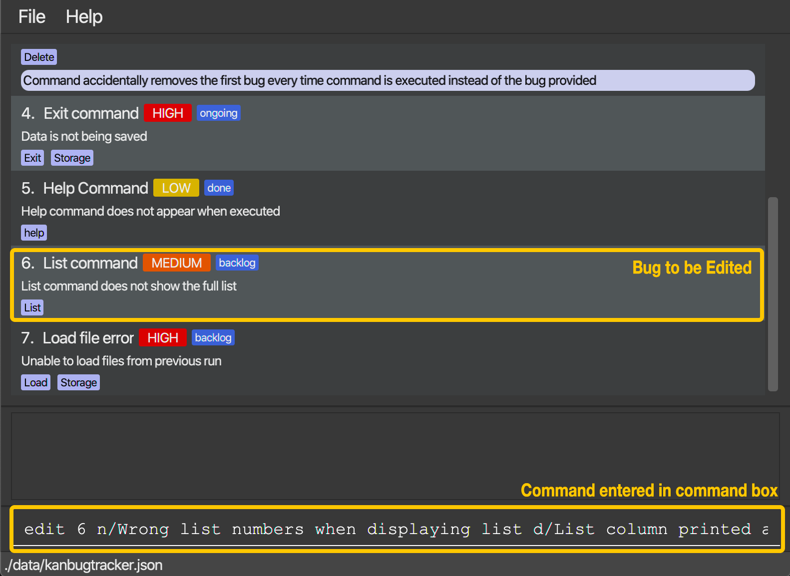

You can type `edit 6 n/Wrong list numbers when displaying list d/List column printed as all 1's pr/high` and press `Enter`.

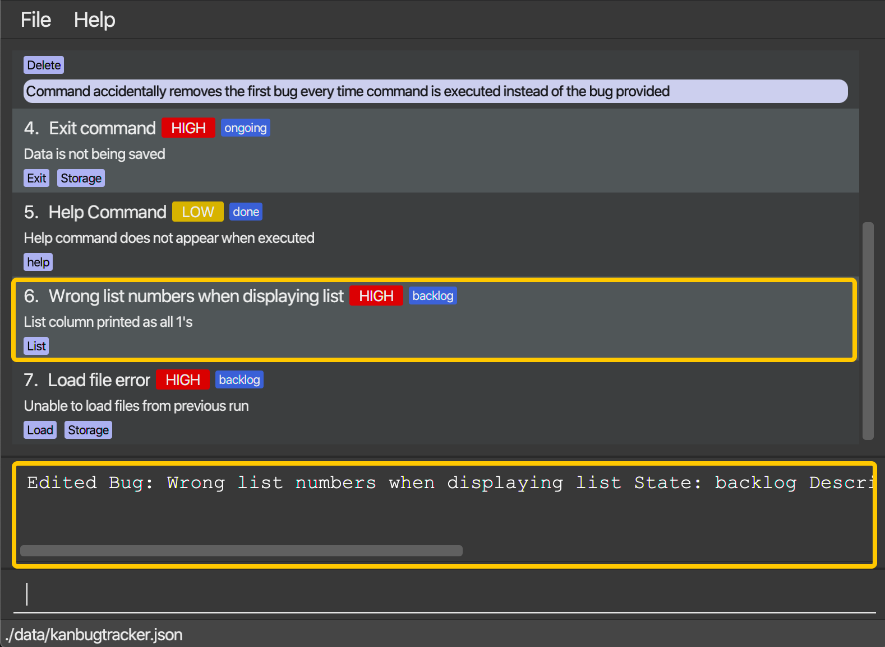

Once the command has been entered, the result display shows the result of your command and the KanBug Tracker has updated the name, description as well as priority.

Example 2 (No walkthrough provided) : Perhaps then you tried a way to fix it that didn't work so you want to add a `note` of **Tried a fix using iterator, did not work**.

Type `edit 6 note/Tried a fix using iterator, did not work` as input and press `Enter`.

Example 3 (No walkthrough provided) : After toiling away at the bug, you realise that you have solved it! So now you want to remove the `priority` of the Bug.

Type `edit 6 pr/` as input and press `Enter`.

### 5.8 Editing a tag of a bug : `editTag`
(by Kishen)

Made a mistake when adding tags to your bug? With this command, you can easily make amends without having to recreate the bug again!

:bulb: Tip: You might be wondering why you can't just use the <code>edit</code> command. Using the <code>edit</code> command would require you to retype every single existing tag on top of the tag you want to edit. With the <code>editTag</code> command, you only need to concern yourself with the tag you want to edit!

Format: `editTag INDEX (c/COLUMN) ot/OLD_TAG nt/NEW_TAG`

- The `OLD_TAG` supplied must be an existing tag.
- The `NEW_TAG` supplied must **not** be an existing tag.
- The `OLD_TAG` will be updated to the `NEW_TAG`

Examples:

Example 1:

You've made a mistake when creating the bug at index **1** of the list and you wish to edit its tag. The tag should be **UserDisplay** instead of **UI**.

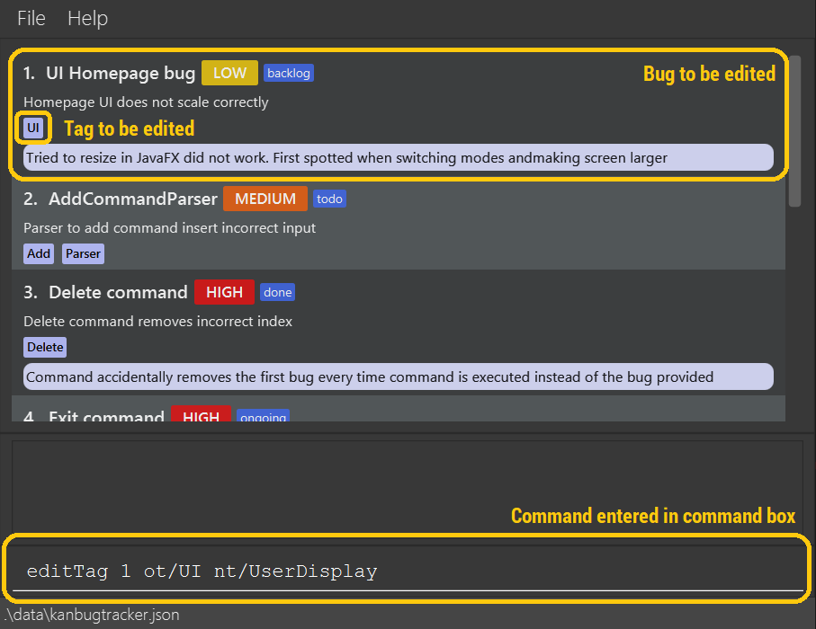

Since you want to edit the tag of the first bug from **UI** to **UserDisplay**, you can enter the command:

 `editTag 1 ot/UI nt/UserDisplay`

The **UI** tag of the bug at index **1** is edited and is now **UserDisplay**. The display at the bottom of the screen confirms that the command has been executed successfully.

Example 2 (No walkthrough provided) :

You are in **Kanban View** and want to edit the **CommandResult** tag of the bug at index **1** of the **backlog column** to **CommandParser**.

You would enter the following command:

`editTag 1 c/backlog ot/CommandResult nt/CommandParser`

:information_source: Note: Since this example takes place in <b>Kanban View</b>, you need to supply a <code>c/COLUMN</code> value.

### 5.9 Adding a tag to a bug : `addTag`
(by Kishen)

Oh no! You've forgotten to add a tag to one of your bugs! Or perhaps you want to add a new one? With this command, adding tags has never been simpler!

:bulb: Tip: You might be wondering why you can't just use the <code>edit</code> command. Using the <code>edit</code> command would require you to retype every single existing tag on top of the tags you want to add. With the <code>addTag</code> command, you only need to concern yourself with the tags you want to add!

Format: `addTag INDEX (c/COLUMN) nt/NEW_TAG`

- The `NEW_TAG` supplied must **not** be an existing tag.

- The `NEW_TAG` will be added to the bug.

- Users can add **multiple tags** by supplying multiple instances of  `nt/NEW_TAG`.

 
:warning: WARNING: Duplicate new tags will only be added once. For instance, suppose the tag <b>UiError</b> is a valid tag that can be added to a particular bug.
 Executing the following command:  
 <code>addTag 1 nt/UiError nt/UiError</code>    
 Will result in the tag <b>UiError</b> only being added to the bug <b>once</b>.
 

Examples:

Example 1:

You've decided that you want to add two new tags, **JavaFx** and **switch** to the bug at index **1** of the list.

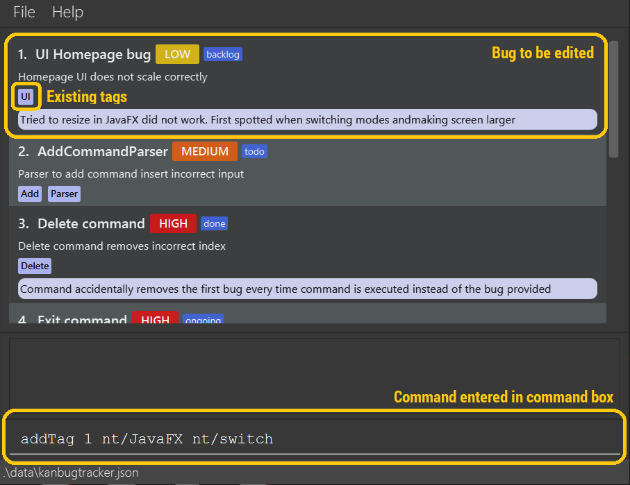

Since you want to add two tags, **JavaFX** and **switch**, to the bug at index **1**, you can enter the command:

`addTag 1 nt/JavaFX nt/switch`

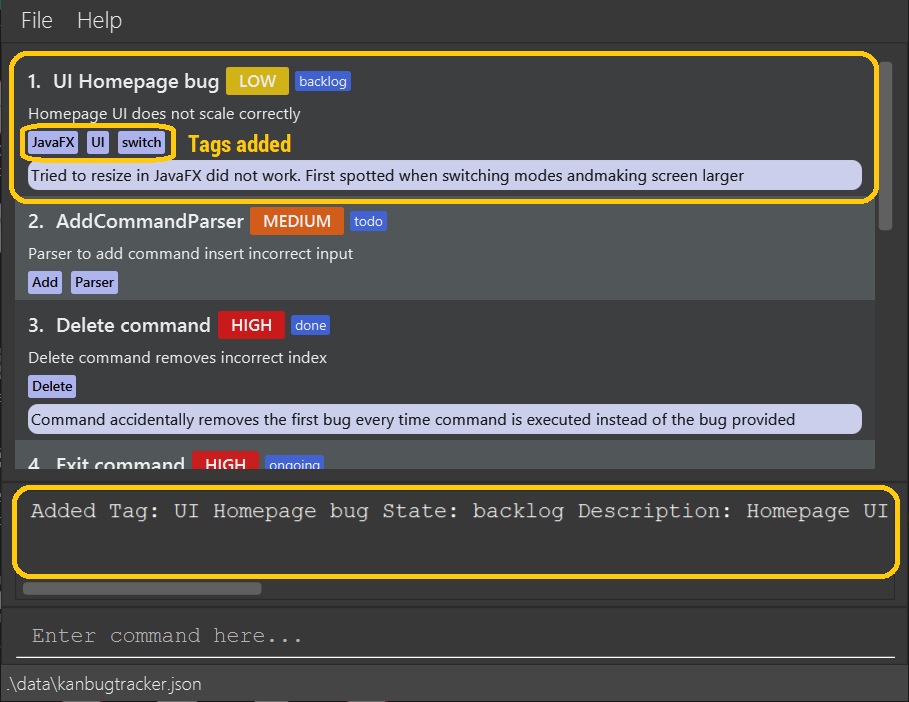

Two new tags, **JavaFX** and **switch** have now been added to the bug at index **1**. The display at the bottom of the screen confirms that the command has been executed successfully.

Example 2 (No walkthrough provided) :

You are in **Kanban View** and want to add the tag **CommandParser** to the bug at index **1**  of the **backlog column**.

You would enter the following command:

`addTag 1 c/backlog nt/CommandParser`

:information_source: Note: Since this example takes place in <b>Kanban View</b>, you need to supply a <code>c/COLUMN</code> value.

### 5.10 Moving a bug : `move`
(by Phong)

Whether you begin to work on a bug, finish fixing one or plan to solve it later, you can use `move` to update your 
progress on dealing with that bug.

Format: `move INDEX (c/COLUMN) s/STATE`

- Specifically, this command will change the state of the bug.
- The `STATE` is **mandatory**.
- State can only be **backlog, todo, ongoing** or **done** (case-insensitive).
- If the `STATE` is the same as the initial state of the bug, no change will be made.
- The `INDEX` must refer to an existing bug (e.g. we cannot move the fifth bug in the List view if there are only four bugs).

Examples:

Example 1:

You are in **Kanban View** and you want to move the second bug in the `Backlog` column to the `Ongoing` column. This
is how you can do it:

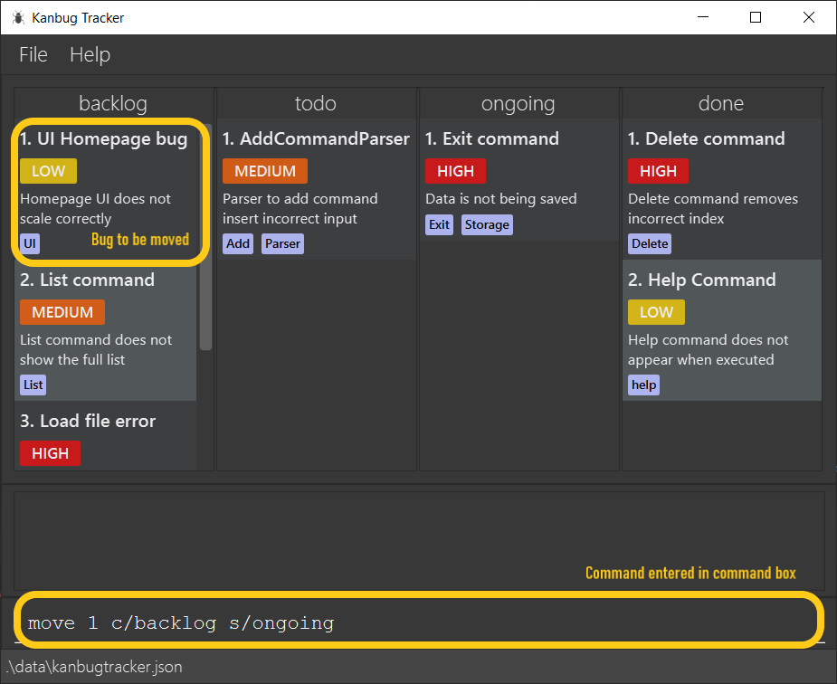

Since the bug is originally in the `Backlog` column, you must supply `c/backlog`. Since you want to move it 
to the `Ongoing` column, you must supply `s/ongoing`. This is the first bug in the column so you must
supply the index `1`. In short, the command you must execute is `move 1 c/backlog s/ongoing`.

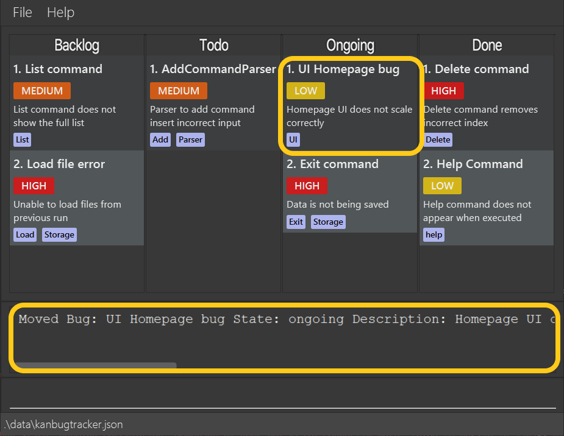

Here the bug has successfully been moved into the new column. The display at the bottom of the screen confirms that
the command has been successfully executed.

Example 2 (No walkthrough provided) :

You are in **List View** and want to move the second bug in your list to the `done` state (assuming its previous state is not `done`).

You would enter the following command: `move 2 s/done`

### 5.11 Clearing all bugs : `clear`
(by Duy)

Imagine the project you just finished ends up with hundreds of bugs recorded in the tracker and you want to move onto the next project. Don't worry! The `clear` command is here to help you to clear all your bugs to reinitialize the KanBug Tracker.

Format: `clear`

Example:   

After the project is done, you might want to clear all the bug records that are not relevant anymore. First, you type this into the command box:

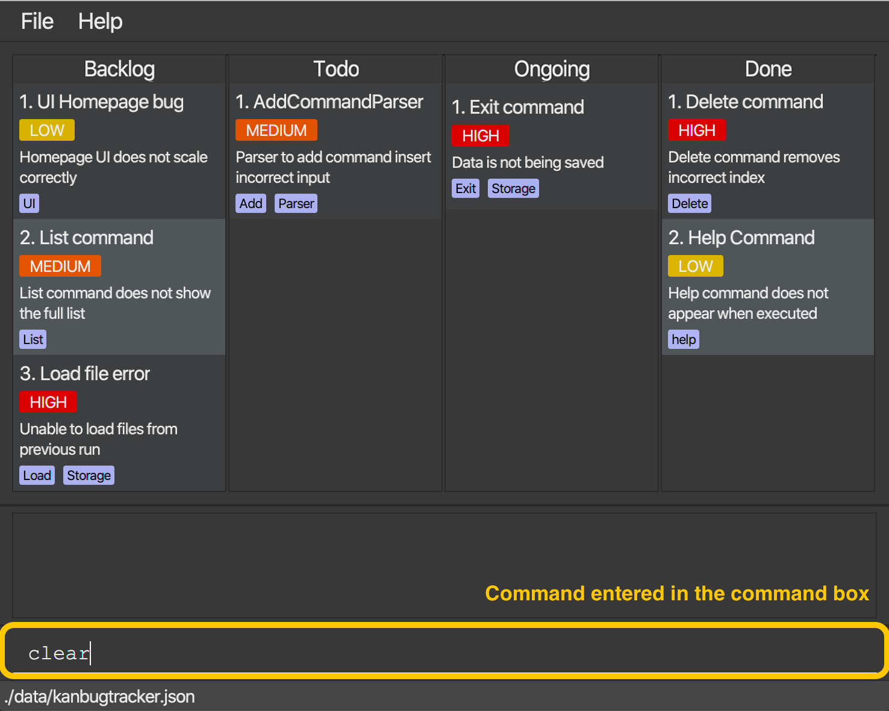

Once the command has been entered, all the bugs are immediately deleted and the result display shows a successful message as follows:

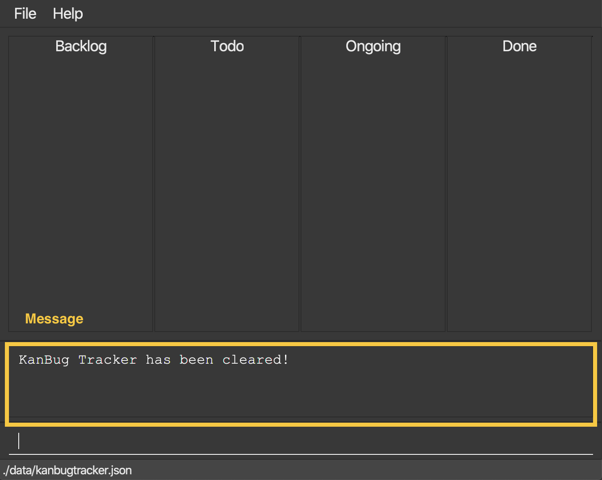

### 5.12 Exiting the program : `exit`
(by Phong)

When you are done with managing your tasks, use this command to save all your bugs and exit the KanBug Tracker.

Format: `exit` 

- This command is applicable to both Kanban and List views.

:bulb: Tip: You can also press the <code>Esc</code> key to close the KanBug Tracker. Try it!

### 5.13 Saving the data : 

The app data is automatically saved at `./data/kanbugtracker.json` every time a change is made. You could also directly
make changes to that file, but it may cause the data file to be unreadable so we **do not recommend** you to do this.
Instead, use the KanBug Tracker itself so it can guide you along the way!

------

## 6. Command Summary

|   Action    |                            Format                            |
| :---------: | :----------------------------------------------------------: |
|  **help**   |                            `help`                            |
| **search**  |                      `search q/QUERYSTRING`                  |
|  **list**   |                            `list`                            |
|   **add**   |   `add n/NAME d/DESCRIPTION [s/STATE] [note/NOTE] [t/TAG] [pr/PRIORITY]`   |
| **delete**  |                        `delete INDEX (c/COLUMN)`                        |
|  **edit**   | `edit INDEX (c/COLUMN) [n/NEW_NAME] [d/NEW_DESCRIPTION] [s/NEW_STATE] [note/NEW_NOTE] [t/NEW_TAG] [pr/NEW_PRIORITY]` |
| **editTag** |       `editTag INDEX (c/COLUMN) ot/OLD_TAG nt/NEW_TAG`       |
| **addTag**  |             `addTag INDEX (c/COLUMN) nt/NEW_TAG`             |
|  **move**   |               `move INDEX (c/COLUMN) s/STATE`                |
|  **clear**  |                            `clear`                           |
|  **exit**   |                            `exit`                            |

[Back to top](#table-of-contents)

Team Name: AY2021S1-CS2103T-W17-1

