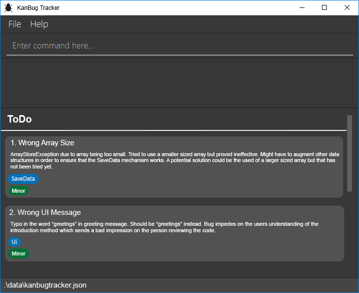

## What is KanBug Tracker?
KanBug Tracker is a **desktop application for managing the tracking of bugs you encounter, optimized for use via a Command Line Interface (CLI)** while still having the benefits of a Graphical User Interface (GUI). If you can type fast, KanBug Tracker can get your bug management tasks done faster than traditional GUI apps.

## Who is this application for?
KanBug Tracker was made to provide a lightweight, offline application for CS2103/T students to manage the bug details of their projects. Users interact with the application entirely through a CLI which makes the application perfect for fast typists. If you are looking for an offline, lightweight and easy-to-use application for your bug tracking needs, KanBug Tracker is the application for you!

## What can users expect?
KanBug Tracker provides two different views that the user can switch between. The first is the traditional Kanban board style view which aims to allow users to get a high-level overview of the state of bugs in their project. The second view is the To-Do list view which allows users to focus only on the bugs within a particular section of the KanBug Tracker. 
#### Main View:

1. Command Line Interface for users to enter their commands
2. Display that the application uses to give feedback on commands to the user
3. Four of pre-declared states that KanBug Tracker comes with. Each bug will be assigned to one of the four states to aid users in tracking the life cycle of each bug.
4. Each individual bug will be displayed with the following data listed in order of display from top to bottom:
    - Name of bug
    - Short description of bug
    - Relevant tags 
    - Priority of bug

#### ToDo View:

- [Getting Started](#getting-started)

- [Features](#features)

  - [Viewing help : **`help`**](#viewing-help--help)
  - [Listing all bugs : **`list`**](#listing-all-bugs--list)
  - [Adding a bug : **`add`**](#adding-a-bug--add)
  - [Deleting a bug : **`delete`**](#deleting-a-bug--delete)
  - [Editing a bug : **`edit`**](#editing-a-bug--edit)
  - [Moving a bug : **`move`**](#moving-a-bug--move)
  - [Exiting the program :  **`exit`**](#exiting-the-program--exit)
  - [Saving the data](#saving-the-data)

- [Command Summary](#command-summary)

  ------

## Getting Started
1. Ensure that you have `Java 11` or above installed on your computer. If you do not have a suitable version of `Java` installed on your computer, you may head [here](https://www.oracle.com/java/technologies/javase-jdk11-downloads.html) to download the installer for your operating system.

2. Download the latest `KanBugTracker.jar` from our [GitHub](https://github.com/AY2021S1-CS2103T-W17-1/tp/releases)
  

  

3. Copy the `KanBugTracker.jar`file to a folder you want to use as your _home folder_.
  
  **Add Note here to describe what is going on**

4. Double-click on the `KanBugTracker.jar`file to launch the application. 

The next section will cover the various features that KanBug Tracker supports.

## Features

- Words in `UPPER_CASE` are parameters to be supplied by the user
- Items in `[...]` are optional

### Viewing help : `help`

Gets a list of all commands that can be used.

Format: `help`

- Gets all commands’ syntax and usage.

### Listing all bugs : `list`

Lists all bugs in the tracker

Format: `list`

- Shows a list of all bugs in the tracker system

### Adding a bug : `add`

Adds a bug to the list

Format: `add n/NAME d/DESCRIPTION [s/STATE] [t/TAG]`

- Add a bug with the specified name, description and state to the bottom of the list.
- The state field is optional, all other fields are needed.
- If state is not specified, a default state of backlog will be assigned.

Examples:

- `add n/Print bug d/prints the wrong message s/todo t/Ui`, adds a bug with name *Print Bug*, Description of *prints the wrong message*, state of *To do* and a tag of *Ui.java*.
- `add n/Move bug d/moves bug to wrong column s/backlog`, adds a bug with name *Move bug*, Description of *moves bug to wrong column* and state of *Backlog*.
- `add n/Move bug d/UI`, adds a bug with name *move bug*, Description of *UI* and state of *Backlog*.

### Deleting a bug : `delete`

Deletes a bug from the list

Format: `delete INDEX`

- Deletes the bug at the specified index

Example:

- `delete 1`, deletes the bug at index one of the bug list.

### Editing a bug : `edit`

Edits an existing bug in the tracker

Format: `edit INDEX [n/NEW_NAME] [d/NEW_DESCRIPTION] [t/NEW_TAG]`

- Edits the bug at the specified `INDEX`. The index refers to the index number shown in the displayed list of bugs. The Index **must be a positive integer** 1,2,3...
- At least one of the optional fields must be provided.
- Existing values will be updated to the input values.
- **Multiple tags** can be added or editted.

Examples:

- `edit 1 n/Wrong list numbers when displaying list d/List column printed as all 1's`, edits the name and description of the 1st bug to be "Wrong list numbers when displaying list" and "List column printed as all 1's" respectively.
- `edit 2 d/When listing items, duplicates are printed`, edits the description of the 2nd bug to be "When listing items, duplicated are printed".
- `edit 3 t/Logger.java t/Logging`, edits/adds the two tags provided *Logger.java* and *Logging*.

### Moving a bug : `move`

Moves an existing bug in the tracker from one state to another

Format: `move INDEX s/STATE`

- Moves the bug at the specified `INDEX`. The index refers to the index number shown in the displayed list of bugs. The Index **must be a positive integer** 1,2,3…
- The state field is **mandatory** and must be provided.
- State can either be **backlog, todo, ongoing** or **done**.
- Existing state will be updated to the new state.

Examples:

- `move 1 s/todo`, moves the 1st bug from its initial state to the “To Do” state.
- `move 3 s/done`, moves the 3rd bug from its initial state to the “Done” state.

### Exiting the program :  `exit`

End and close the app.

Format: `exit`

- Saves all of the local data and exit.

### Saving the data : automatically

Data is saved into the hard disk everytime a change is made.

------

## Command Summary

|   Action   |                          Format                           |
| :--------: | :-------------------------------------------------------: |
|  **help**  |                          `help`                           |
|  **list**  |                          `list`                           |
|  **add**   |       `add n/NAME d/DESCRIPTION [s/STATE] [t/TAG]`        |
| **delete** |                      `delete INDEX`                       |
|  **edit**  | `edit INDEX [n/NEW_NAME] [d/NEW_DESCRIPTION] [t/NEW_TAG]` |
|  **move**  |                   `move INDEX s/STATE`                    |
|  **exit**  |                          `exit`                           |

Team Name: AY2021S1-CS2103T-W17-1

